# 企业如何落地 Agent-Native 架构：五层参考架构 + 四原则 + 路线图（含治理）

> 原文标题：**《Agent-Native：企业软件架构的下一次范式重构》**（本文为同一内容的持续更新版）

从 OpenClaw 的爆火，到浏览器 Agent、代码 Agent、AI 员工平台和 MCP 生态的快速升温，可以看到 Agent 已经不再只是模型能力的展示窗口，而开始成为真正具备端到端执行力的软件形态。本文面向企业架构师与平台团队，讨论企业 IT 如何从“应用集合”演进为“可编排能力网络”，并给出面向 Agent 的参考架构、设计原则和落地路线图。

**如果你只有 3 分钟：**先读 [文章速览](#quick-summary) → [落地评估清单](#appendix-checklist)。

**想把长文拆成可分发短文：**见 [series/README.md](./series/README.md)（10 篇拆文骨架，篇篇可回链引流）。

## 目标读者

- 企业架构师、平台架构师、技术管理者
- 负责 API 平台、集成平台、数据平台、AI 平台的团队
- 正在评估 Agent 落地路径的业务与风险治理团队

## 阅读建议

- 全文约 `5.1` 万字，完整阅读预计 `130-160` 分钟。
- 如果你只想快速把握观点：先读 [文章速览](#quick-summary)。
- 如果你关注架构蓝图：优先阅读第 4、5、6、7、8、9、10 章。
- 如果你关注组织落地：优先阅读第 11、12 章和 [附录：企业落地评估清单](#appendix-checklist)。

<a id="quick-summary"></a>
## 文章速览

1. 企业系统正在从“人主导操作”转向“人定义目标与约束、Agent 执行流程”。这类变化已在客服运营、供应链协同、生产运维、金融风控等场景出现。
2. 落地难点通常不在模型本身，而在系统是否支持机器稳定调用。常见问题是接口不可发现、语义不统一、流程不可编排、执行不可审计。
3. 只有把关键业务动作沉淀为可调用能力，把规则写成可校验约束，把跨系统流程改造成可执行任务链，Agent 才能从“建议工具”变成“执行单元”。
4. 本文聚焦架构层面的建设方法：`API-first -> Schema-first -> Capability-based -> Observable`，并给出对应的五层参考架构与实施顺序。
5. 四条最小共识原则是：`API-first`（关键业务动作必须可调用）、`Schema-first`（业务语义必须机器可校验）、`Capability-based`（从接口清单升级为能力目录/能力图）、`Observable`（决策与执行可追踪、可还原、可运营）。
6. 对应的五层参考架构为：`Interface Layer`（Gateway/Discovery/Schema/Auth/RateLimit）、`Capability Layer`（Registry/Graph/Policy Binding）、`Data & Knowledge + Memory Layer`（结构化事实+知识+任务/经验记忆）、`Runtime & Orchestration Layer`（计划-执行-补偿-人工接管）、`Security & Governance Layer`（身份/策略/审计/合规贯穿全链路）。
7. 落地顺序建议按三步推进：先做高频异常闭环（验证端到端执行价值），再做关键流程协同（跨系统编排能力），最后做组织级治理与平台化运营（标准化、复用、可控）。
8. 对企业来说，竞争差异将更多体现在执行网络建设能力，而不只是系统数量或功能覆盖度。
9. 因此，Agent-Native 讨论的核心不是“新增一个 AI 功能”，而是企业软件如何从信息处理系统升级为可控的执行系统。


---

## 仓库说明

| 项目 | 说明 |
|---|---|
| 仓库地址 | [bluegitter/ai-native-arch](https://github.com/bluegitter/ai-native-arch) |
| 适用场景 | 中大型企业、强调治理、审计、稳定执行优先的 Agent 落地场景 |
| 维护方式 | 当前以单文件持续更新，适合演讲、分享、内部评审和方案沉淀 |
| License | [CC BY 4.0](./LICENSE) |
| 引用方式 | 引用仓库链接，并注明文档标题《Agent-Native：企业软件架构的下一次范式重构》 |
| 贡献方式 | 建议通过 Issue/PR 反馈术语、案例、图示和落地经验补充点 |

<a id="table-of-contents"></a>
## 目录

- [术语表 / 关键词](#glossary)
- [第1章 引言：企业架构进入 Agent 时代](#chapter-01)
- [第2章 概念澄清：避免架构讨论中的认知混用](#chapter-02)
- [第3章 传统企业应用架构的结构性瓶颈](#chapter-03)
- [第4章 Agent-Native 应用蓝图：从辅助工具到执行网络](#chapter-04)
- [第5章 Agent-Native 设计原则](#chapter-05)
- [第6章 参考架构：从应用分层到能力分层](#chapter-06)
- [第7章 Interface 层：Agent 执行的统一接入面](#chapter-07)
- [第8章 Capability 层：企业能力的稳定编排](#chapter-08)
- [第9章 Data 与 Memory 层：企业上下文基础](#chapter-09)
- [第10章 Runtime 层：从生成到交付](#chapter-10)
- [第11章 安全与治理：Agent 能上线的前提不是“更聪明”，而是“更可控”](#chapter-11)
- [第12章 企业落地路线图：从局部试点到组织级平台](#chapter-12)
- [第13章 组织与商业模式变化：技术架构如何重塑企业价值链](#chapter-13)
- [第14章 结语：企业 IT 正从“应用集合”演进为“可编排能力网络”](#chapter-14)
- [参考文献](#references)
- [附录：企业落地评估清单](#appendix-checklist)
- [附录A：规范引用（OpenAPI）](#appendix-openapi-spec)

<a id="glossary"></a>
## 术语表 / 关键词

| 术语 | 含义 |
|---|---|
| Agent | 以目标为中心、能够理解上下文并调用外部能力持续执行任务的系统形态 |
| LLM | 提供理解、生成与推理能力的大模型，不等同于完整业务系统 |
| Skill | 面向特定任务域的可复用执行策略包，通常包含步骤模板、约束规则和工具选择偏好 |
| Tool | 被 Agent 调用的最小外部执行单元，例如 API、数据库查询、脚本、搜索或业务系统操作 |
| Capability | 面向业务结果的能力单元，通常由接口、规则、状态约束和治理信息共同构成 |
| Runtime | Agent 的执行控制平面，负责任务生命周期、调度、补偿、审计和可观测性 |
| Discovery | 让 Agent 在运行时发现能力、理解语义和感知版本变化的机制 |
| MCP | 面向 Agent 工具接入的一类协议，可与企业内部 REST/API 体系分层协同 |
| OpenAPI | OpenAPI Specification（OAS）接口描述规范，用于定义 API 路径、参数、请求/响应和 schema，支持 SDK 生成与契约校验 |
| Memory | 支撑 Agent 持续正确执行的上下文记忆，包括任务记忆、知识记忆和经验记忆 |
| SLO | 服务等级目标，本文中特别强调任务成功率、时延、成本与风险的综合约束 |

<a id="chapter-01"></a>
## 第1章 引言：企业架构进入 Agent 时代

如果说 2026 年春天有什么事件让“Agent 不再只是一个技术热词”这件事突然变得具体，那么 OpenClaw 的爆发式出圈就是最典型的信号之一。这个开源 Agent 平台在极短时间内获得了惊人的社区关注，甚至一度以极快速度冲上 GitHub 最高星标项目行列；与此同时，围绕其本地执行能力、工具调用权限和安全边界的争议也迅速升温。这两个现象放在一起看，恰好揭示了一个更重要的事实：Agent 的真正挑战，从来不只是“模型更聪明了”，而是“软件开始具备代表用户持续执行动作的能力”。

OpenClaw 之所以值得关注，不只是因为它火，而是因为它把一个原本还停留在演示层的趋势，直接推到了架构层和治理层。过去大家讨论 AI 时，更多关注问答、生成和 Copilot；而 OpenClaw 这类系统让更多人第一次直观感受到，AI 正在从“给建议”走向“直接操作浏览器、文件、终端和应用”，从“回答问题”走向“执行任务”。一旦软件开始具备这种执行力，企业系统的接口形态、能力组织方式、运行时控制和平安治理边界，就都需要被重新审视。

过去二十年，企业信息化建设的主线是“把业务流程软件化”。从 ERP、CRM 到 OA、BI，系统边界基本围绕“人”展开：人登录系统、人点击页面、人在不同系统间搬运信息。即使进入微服务和云原生阶段，企业架构的核心假设依然是“人是主要执行者，系统是辅助工具”。

如果放在软件代际演进里看，上述阶段对应的是典型的 Software 1.0；后来企业大量引入数据驱动和模型能力，对应 Software 2.0；而当前 Agent 的兴起，标志着企业系统开始进入 Software 3.0 的工程化阶段，即系统不仅“给出判断”，还要“在约束下执行任务”。

这个假设正在被打破。大模型让机器第一次具备了在复杂上下文中理解目标、分解任务、调用能力并持续执行的可能性。企业开始引入 Agent，不再满足于“问答助手”或“页面内 Copilot”，而是希望它能够跨系统完成一条完整业务链路，例如从“识别关键异常”到“自动拉取多源数据、生成研判结论、提出处置建议并推动审批闭环”。这意味着 Agent 不只是新的人机交互入口，而是在企业系统中逐步成为新的执行主体。

当执行主体发生变化，架构中心也会变化。传统架构强调应用系统边界、菜单流程和角色页面；Agent 时代的架构更强调能力暴露、可发现接口、可编排执行和可审计决策。简单说，企业 IT 正从“应用集合”向“能力网络”迁移：系统不再主要以页面组织，而是以可调用能力组织；流程不再完全预编排，而是由 Agent 在约束下动态规划；自动化不再局限于固定脚本，而是进入可持续运行、可反馈学习的阶段。

如果进一步概括，这其实是一种架构理念的迁移：企业软件正在从“以人为中心”逐步走向“以 Agent 为中心”。这里的“以 Agent 为中心”并不是否定人的作用，而是指系统的核心设计对象不再只是“人如何进入页面并完成操作”，而开始转向“Agent 如何稳定理解目标、调用能力并在治理约束下完成任务”。人仍然负责目标设定、策略约束、例外审批与结果负责，但执行链路中的越来越多标准化动作，将由 Agent 作为新的执行主体来承担。

这也意味着传统软件工程师的工作重心会发生变化。过去，很多企业开发工作主要围绕页面、表单、菜单和流程节点展开；而在 Agent-Native 架构下，工程师将越来越多地把专项企业能力沉淀为可调用、可治理、可审计的能力单元，供 Agent 在运行时发现、组合和执行。研发工作的重心，将从“给人做系统”逐步转向“为 Agent 建能力底座”。

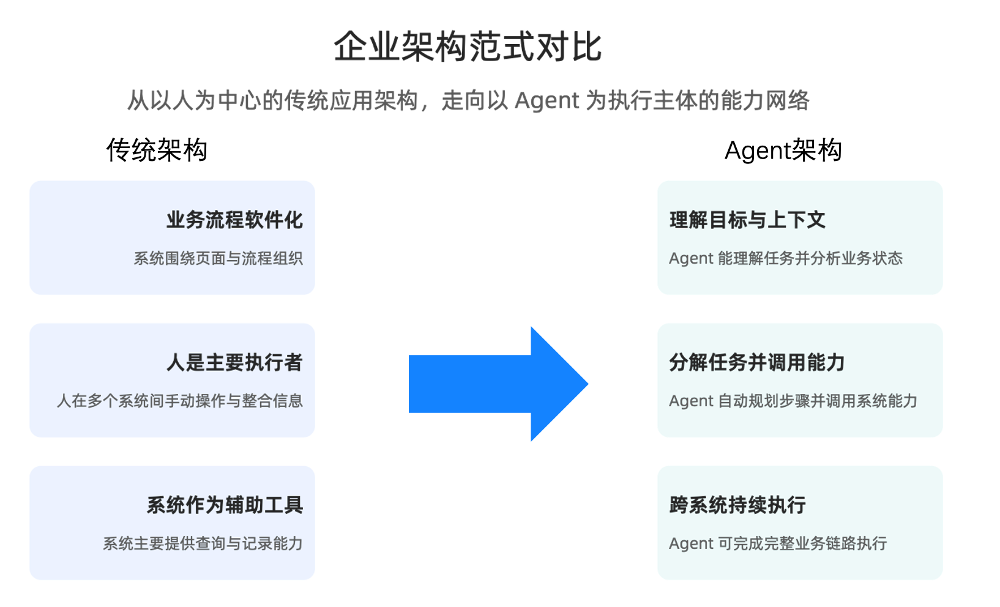
_图：企业架构从“以人操作页面”为中心，转向“以 Agent 调用能力网络”为中心。_

这一变化并不意味着现有系统会被推倒重来。相反，未来三到五年最现实的路径是“增量演进”：在保留核心交易系统稳定性的前提下，把既有系统中的关键业务动作逐步能力化、接口化、治理化，让 Agent 能够安全、可靠地接入并执行。谁先完成这一步，谁就更可能在组织效率、响应速度和运营成本上形成新的结构性优势。

因此，讨论“Agent-Native：企业软件架构的下一次范式重构”，本质上不是讨论某个模型是否更强，而是回答三个更基础的问题：企业系统如何被 Agent 理解，企业能力如何被 Agent 调用，企业风险如何在 Agent 执行中被持续控制。后续章节将围绕这三个问题展开。

<a id="chapter-02"></a>
## 第2章 概念澄清：避免架构讨论中的认知混用

在企业实践中，很多关于 Agent 的讨论会迅速陷入分歧，常见原因不是技术路线本身，而是关键概念被混用。团队表面上都在谈“智能体落地”，但有人谈的是模型能力，有人谈的是流程编排，有人谈的是 RPA 自动化，还有人谈的是 API 接入改造。概念一旦混用，架构讨论就很容易从一开始就失焦。

这种失焦的代价并不抽象。它会直接影响立项目标、技术选型和组织分工：本该建设执行闭环，却只上线了问答助手；本该抽象业务能力，却把重点放在提示词和界面交互；本该设计治理与审计，却误以为“模型效果更好”就能替代工程约束。最后项目不是没有产出，而是产出的东西与企业真正需要的架构能力并不对应。

因此，第2章的任务不是做概念科普，而是给后续章节建立统一坐标系。只有先把 Agent、Skill、Tool、LLM、Workflow、RPA、Capability、Runtime、Memory、Protocol 这些概念的边界划清，后面关于接口、数据、编排、治理和落地路线图的讨论才有一致语境。

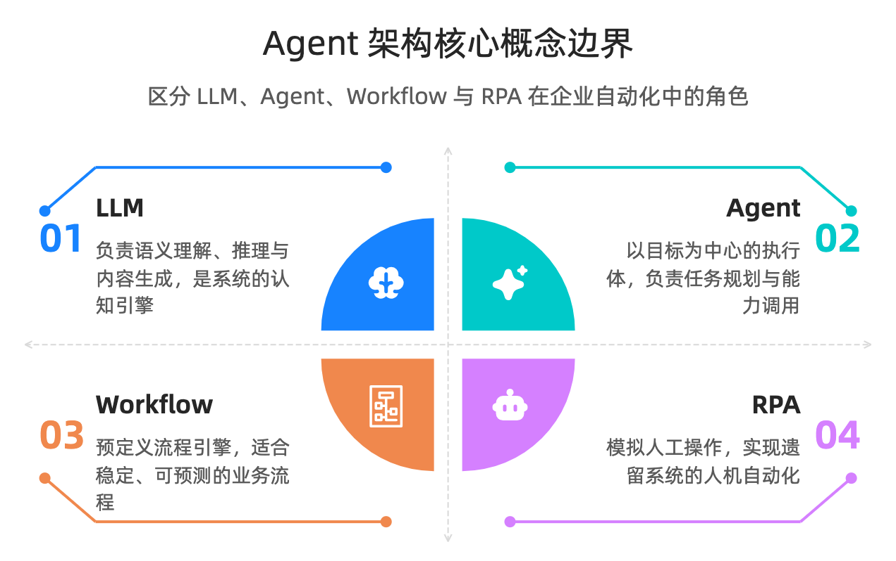
_图：Agent、LLM、Workflow、RPA 的边界对比，用于统一讨论语境。_

### 2.1 Agent、LLM、Workflow、RPA 的边界

LLM 是“认知与生成能力”，负责理解语义、生成内容、推理方案，但它本身不等于业务系统。Agent 是“以目标为中心的执行体”，通常由模型、工具接口、上下文管理、策略约束和执行循环组成。换句话说，LLM 是 Agent 的核心引擎之一，但 Agent 还包含执行与治理机制。

Workflow 是预定义流程引擎，强调确定性、可追踪、固定节点编排。它适合高稳定、低变化的流程，如固定采购审批链、标准化工单流转、规则化异常通知。RPA 是对现有人机操作的自动化复刻，优势是无需改造底层系统即可快速落地，但在跨场景泛化和复杂异常处理上成本较高。

这四个概念最容易被混淆的地方，在于它们都看起来像“自动化”。但它们解决的问题并不相同：LLM 解决的是理解与生成，Agent 解决的是围绕目标持续执行，Workflow 解决的是确定性流程编排，RPA 解决的是对既有人机操作的自动化复刻。若不区分这一点，企业很容易用一种工具去替代另一种工具应承担的职责。

从工程视角看，LLM 更像智能引擎，决定系统在理解、推理和生成上的上限；Agent 更像执行体，决定系统能否把目标拆成步骤、调用工具并在反馈中持续推进；Workflow 更像稳定骨架，适合承载高确定性、高合规、固定路径的流程；RPA 更像过渡性补丁，适合在遗留系统尚未能力化之前快速填补自动化缺口。

Agent 与 Workflow/RPA 的关键差异，在于它可以在约束条件下进行动态规划。它不是简单替代流程引擎，而是补足“流程之外”的决策与编排能力；它也不是简单替代 RPA，而是在更高抽象层上决定“什么该做、何时切换路径、何时转人工”。因此，更合理的企业形态通常不是四选一，而是分层协同：LLM 提供认知能力，Workflow 负责稳定骨架，RPA 覆盖遗留系统缺口，Agent 处理跨系统、非结构化和高变化任务。

对企业架构而言，这一边界划分非常关键。若把 LLM 直接当 Agent，就会高估模型本身的可执行性；若把 Agent 当 Workflow，就会低估动态规划与异常处理的复杂度；若把 RPA 当长期主干能力，就会把短期可落地手段误当成长期架构底座。只有先把这四者放回各自的位置，后续关于 Capability、Runtime 和治理层的设计才不会跑偏。

| 技术     | 解决问题   | 特点     |
| -------- | ---------- | -------- |
| LLM      | 理解与生成 | 智能引擎 |
| Agent    | 任务执行   | 目标驱动 |
| Workflow | 固定流程   | 确定性   |
| RPA      | 操作自动化 | 模拟人工 |

### 2.2 Capability 与 API 的关系

API 是接口形式，Capability 是业务能力单元。一个 Capability 往往由多个 API、规则和状态约束共同构成。例如“发起高风险异常处置工单”并不只是一次 `POST /work-orders`，还包含风险等级校验、变更窗口核对、审批权限策略和审计记录。

两者的差异，可以简单理解为：API 回答“怎么调用”，Capability 回答“完成什么业务结果”。前者偏技术接入，关注端点、参数、协议和返回值；后者偏业务抽象，关注目标、约束、前置条件、执行边界和责任归属。对人类开发者来说，可以在大量 API 文档和领域经验之间做脑内映射；对 Agent 来说，如果没有显式的 Capability 抽象，就只能在零散接口中猜测业务意图。

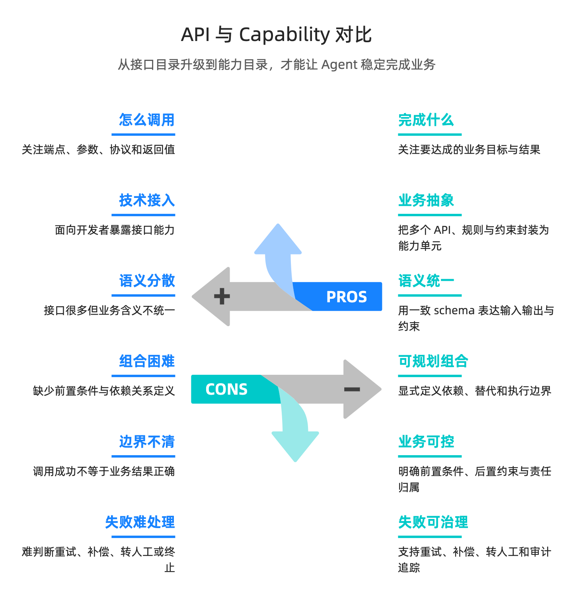
_图：API 描述的是单次技术调用，Capability 描述的是带有业务语义、约束和治理信息的可执行能力单元。_

如果企业只做 API 暴露，不做 Capability 建模，Agent 接入后通常会面临三个问题：第一，接口很多但语义分散，难以正确选择与组合；第二，接口可调但业务边界不清，容易出现“调用成功但业务错误”；第三，失败不可解释，系统很难判断应当重试、补偿、转人工，还是直接终止流程。

因此，面向 Agent 的架构不能停留在“接口目录”，而需要升级到“能力目录”。能力目录不是把 API 换个名字重新登记，而是把业务动作包装成可规划、可治理的最小单元。一个合格的 Capability 至少需要回答六个问题：它要达成什么业务目标，输入输出是什么，调用前需要满足什么条件，执行过程中有哪些约束，失败后如何处理，以及结果由谁负责、如何审计。

从工程视角看，Capability 是 Agent 进行任务规划时真正可消费的对象。Agent 不应该直接面对一堆风格各异的底层 API，而应优先理解“可执行能力节点”以及这些节点之间的依赖、替代和约束关系。只有这样，系统才能把“能调用接口”进一步提升为“能稳定完成业务”。这也是后文会反复强调 Capability Layer 的原因：它不是文档层包装，而是企业把业务可执行性从应用内部抽离出来的关键抽象层。

### 2.3 Runtime、Memory、Protocol 的职责划分

Runtime 是 Agent 的执行控制平面，负责计划生成、任务调度、工具调用、重试回滚、异常升级和可观测性采集。没有 Runtime，Agent 往往只能停留在“单次问答”；有了 Runtime，Agent 才能以任务生命周期为单位稳定运行。

Memory 是上下文连续性的基础设施，不只是“聊天记录”。在企业场景中，Memory 通常包括短期任务记忆、长期业务记忆和策略性经验记忆。它决定 Agent 能否在多轮、多天甚至跨部门协作中保持一致行为。

Protocol 是 Agent 与外部能力交互的协定层，核心目标是让能力可发现、可验证、可授权、可演进。它关注的不是“接口写没写出来”，而是“不同团队、不同系统、不同 Agent 能否以一致方式互操作”。

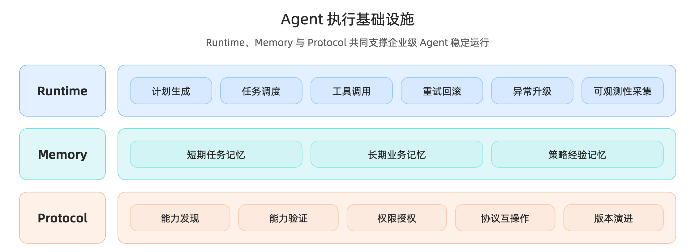
_图：Runtime、Memory、Protocol 在企业 Agent 体系中的职责分层。_

### 2.4 Agent、Skill、Tool、MCP 如何协同工作

在企业落地中，Agent、Skill、Tool、MCP 经常被混用。一个更实用的划分方式是：Agent 负责目标理解与执行决策，Skill 负责“怎么做更稳”的任务策略，Tool 负责“实际做动作”的外部执行，MCP 负责把工具能力以统一协议暴露给 Agent。四者不是并列替代关系，而是运行时分层协作关系。

可以把它理解为一条执行链路：用户提出目标后，Agent 先做任务分解并识别约束，再选择合适的 Skill 生成执行计划；在调用阶段，Agent 通过 MCP 发现并访问 Tool，由 Runtime 按计划执行并回收结果，随后反馈给 Agent 继续推进下一步。遇到异常时，Agent 可以根据 Skill 里的回退策略切换 Tool、重试或转人工审批。

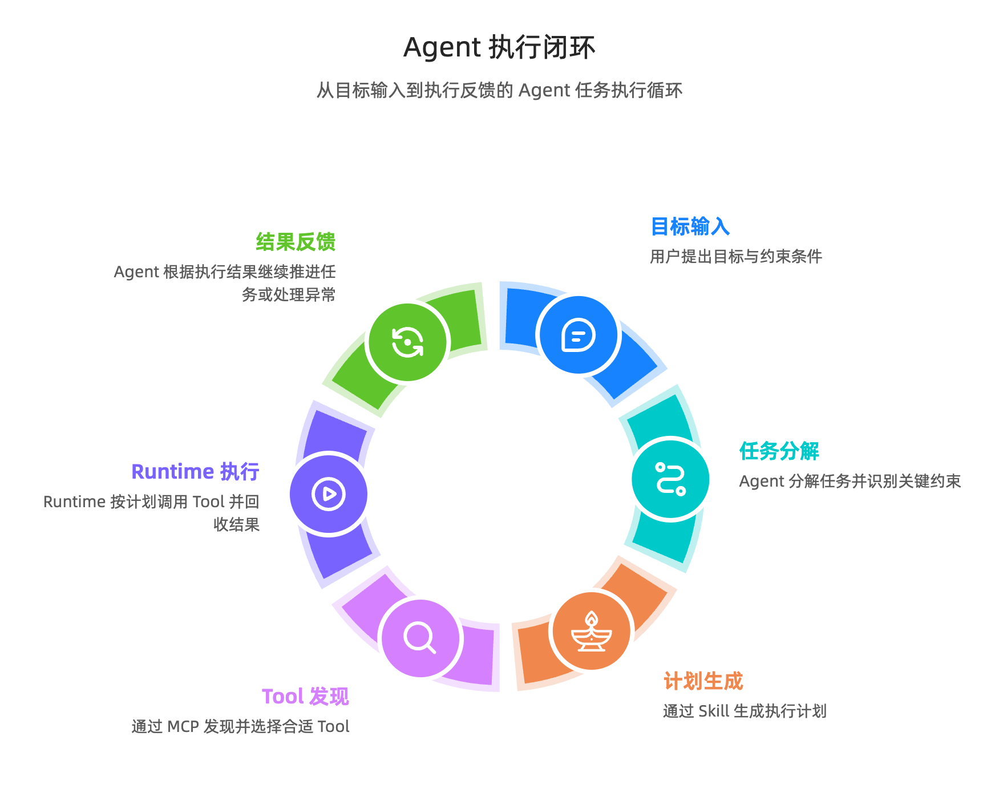
_图：Agent、Skill、MCP、Tool 的分层协同关系。Agent 负责目标与决策，Skill 负责策略约束，MCP 负责统一工具接入，Tool 负责外部执行。_

在这个过程中，Skill 的价值不是“多一个名词”，而是把专家经验和稳定做法从提示词里抽出来，变成可版本化、可复用、可治理的策略资产。Tool 的价值也不只是“能连上系统”，而是通过明确输入输出、权限边界和错误语义，保证执行动作可预测、可审计、可追责。MCP 的价值则在于把不同来源、不同风格的工具接入方式标准化，降低 Agent 侧集成复杂度。

从工程视角看，四者分工可以概括为：Agent 决定目标路径，Skill 约束执行策略，MCP 统一工具接入协议，Tool 完成外部操作。只有四者职责清晰，企业系统才可能同时实现执行效率和治理可控。

### 2.5 FastGPT / Dify 与自主编排 Agent 的边界

在企业实践里，FastGPT、Dify 这类平台常被统称为“智能体平台”，但它们的默认重心与自主编排 Agent 并不相同。前者更偏“AI 应用搭建平台”，强调知识库接入、工具接入和流程编排的快速上线；后者更偏“执行型系统”，强调任务生命周期、动态规划、异常恢复和审计治理。

这个差异的核心不是交互界面，而是系统目标：你是在构建“对话式应用入口”，还是构建“可控的执行系统”。如果两者边界不清，企业会出现常见误判：以为“能对话+能调工具”就等于端到端可交付，或以为“流程图更复杂”就等于更智能。

| 维度 | AI 工作流/应用搭建平台（典型 FastGPT / Dify） | 自主编排 Agent（Autonomous Orchestration） |
|---|---|---|
| 控制方式 | 预定义路径为主 | 目标与约束驱动，运行时规划路径 |
| 适用任务 | 稳定流程、可枚举分支 | 高变化、跨系统、分支难穷举 |
| 异常处理 | 预设分支/人工兜底 | 重试、补偿、降级、切换能力、转人工 |
| 状态管理 | 流程状态为主 | 任务生命周期状态机（可恢复/可接管） |
| 治理重点 | 节点权限与基础审计 | 主体身份、策略引擎、全链路可追责 |

工程上不建议做“二选一”。更现实的组合是：用 Workflow 承载确定性骨架（强合规、固定审批、稳定路径），用自主编排 Agent 处理流程之外的动态部分（高变化场景、异常闭环、跨系统协同），再由统一 Runtime 与治理层控制全链路。

选型时可以用一个快速判定：若一个场景同时满足“跨系统长链路”“需要等待外部状态”“失败后必须继续推进/补偿”“高治理可追责要求”中的任意两项，通常不应只靠 Workflow 或应用搭建平台硬顶，而应引入任务运行时能力。

### 2.6 小结：先统一边界，再谈架构

概念澄清不是术语科普，而是架构落地的前置条件。若把 LLM、Workflow、应用搭建平台和自主编排 Agent 混为一谈，项目往往会出现三类偏差：目标错位（把问答入口当执行系统）、分层错位（把 Runtime/Memory/Protocol 当实现细节）、治理错位（有自动化动作但缺少可追责链路）。先统一边界，后续关于接口、能力、编排与治理的设计才有共同坐标系，跨团队评审也才可执行。

可以用一句话总结本章：LLM 决定智能上限，Agent 决定执行形态，Skill 决定策略复用，MCP 决定工具接入一致性，Tool 决定动作落点，Capability 决定组织方式，Runtime 决定工程可靠性，Protocol 决定生态可扩展性。企业架构升级必须同时覆盖这八个维度。第3章将继续讨论一个更现实的问题：为什么传统企业应用架构即使已经做了大量系统建设，仍然难以支撑 Agent 的稳定执行。

<a id="chapter-03"></a>
## 第3章 传统企业应用架构的结构性瓶颈

在讨论“新架构”之前，需要先识别旧架构的真实约束。多数企业并不是没有系统，而是系统太多、太碎、太难协同。Agent 之所以成为趋势，不是因为概念新，而是因为它正好对准了传统架构长期未解决的结构性问题。

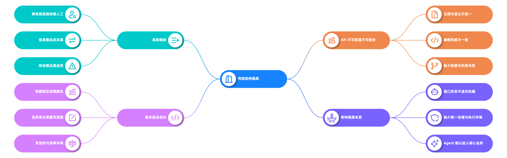
_图：传统企业应用烟囱、流程断点和人工串联带来的结构性问题。_

### 3.1 系统烟囱与流程断点

企业通常已经建设了大量业务系统，每个系统都在自身边界内优化得不错，但跨系统流程往往依赖人工串联。一个看似简单的业务动作，例如“处置关键异常告警”，可能需要先查实时监控系统，再查资产/主数据系统，再查生产管理系统，再查工单平台，最后由人工整合结论并触发后续流程。

这类流程断点有三个直接后果：响应慢、错误率高、责任难追踪。系统越多，跨系统协调成本越高；流程越长，人工搬运信息的损耗越大。传统集成方式虽然能缓解一部分问题，但往往依赖重流程改造，交付周期长，难以跟上业务变化速度。

### 3.2 API“可用但不可发现、不可组合”

很多企业已经完成了 API 化，但对 Agent 来说仍然不够。原因在于这些 API 主要为“人类开发者”设计：文档分散、语义不统一、参数命名风格不一致、错误码体系割裂。对人而言，这些问题可以通过经验和沟通弥补；对 Agent 而言，这会直接影响调用正确率与规划效率。

更关键的是“不可组合”。接口之间缺少明确依赖关系和前置约束，Agent 很难自动判断“先调用哪个、失败后如何补偿、结果如何回写”。最终结果是：API 数量很多，但可自动化编排的能力很少。企业以为已经具备“机器可调用能力”，实际上只是具备“人工可开发接口”。

### 3.3 自动化长期停留在脚本级

传统自动化主要依赖固定脚本、规则引擎和 BPM 编排，这些方案在稳定场景效果很好，但在高变化场景容易失效。一旦业务规则变化、异常分支增多、数据来源新增，脚本需要频繁重写，维护成本快速上升。

这带来一个常见悖论：自动化做得越深，系统刚性越强；流程越依赖固定路径，组织对不确定环境的适应能力越弱。企业往往在“效率”和“灵活性”之间被迫二选一。Agent 的价值就在于提供第三种可能：在治理边界内进行动态决策，把“不可预编排”的部分从人工转移到机器执行。

### 3.4 架构瓶颈：接口形态而非算力

不少企业把 Agent 落地困难归因为模型不稳定或推理成本高，但从工程实践看，更常见的瓶颈其实在接口与治理层。没有统一 discovery、schema 和权限策略，模型再强也只能停留在“建议层”；没有稳定执行环境与审计闭环，自动执行就难以进入核心业务。

因此，传统架构升级的优先级应当是：先打通能力接口和治理底座，再扩大 Agent 决策范围。只有当系统被改造为“可被理解、可被调用、可被追责”的形态，Agent 才能从局部助手升级为企业级执行网络。

### 3.5 章节小结

传统企业架构的核心问题可以概括为三点：系统烟囱导致流程断裂，API 形态导致机器难用，脚本自动化导致扩展受限。它们共同指向同一个结论：企业需要的不是更多孤立应用，而是一套可编排、可治理、可持续演进的能力化架构。这也是后续章节进入设计原则与参考架构的起点。

<a id="chapter-04"></a>
## 第4章 Agent-Native 应用蓝图：从辅助工具到执行网络

在识别了传统架构的结构性瓶颈之后，一个更现实的问题是：未来基于 Agent 的企业应用到底会长成什么样。很多讨论停留在“智能问答”“工作台 Copilot”或“某个场景自动化助手”层面，但这些都还不是完整蓝图。真正的 Agent-Native 应用，不是给现有系统外挂一个对话入口，而是让 Agent 逐步成为企业系统中的新型执行主体，在治理约束下持续调用能力、处理任务并推动结果闭环。

因此，第4章不讨论底层设计原则，而先回答“未来图景是什么”。只有先看清 Agent-Native 应用的目标形态和真实场景，后面关于设计原则、架构分层和治理约束的讨论才不会失焦。第4章描述目标蓝图，第5章开始进入建设路径。

### 4.1 目标蓝图：从人驱动应用到 Agent 执行网络

传统企业应用通常围绕“人如何进入系统并完成操作”来设计：页面是入口，流程是骨架，角色权限围绕岗位展开。而在 Agent-Native 图景下，系统将越来越多围绕“Agent 如何理解目标、调用能力、处理异常并交付结果”来组织。页面不会消失，但页面的角色会逐步从“唯一操作入口”转变为“人机协同、审批干预和结果监督的界面”。

这意味着企业应用的核心组织单元将发生变化。过去的核心交付物是页面、表单、菜单和流程节点；未来的核心交付物将越来越多地变成可调用能力、结构化上下文、执行策略和治理规则。传统软件工程师的工作也会随之迁移：不再只是为员工开发页面，而是持续把企业中的专项能力抽象、封装、治理并产品化，让 Agent 可以安全地发现、组合和执行这些能力。

从更宏观的视角看，未来企业软件将逐步呈现“双层形态”：上层是人机协同界面，负责目标输入、策略确认、异常审批和结果可视化；下层是 Agent 执行网络，负责能力调用、任务编排、状态推进和执行反馈。企业竞争力将越来越取决于这张执行网络是否足够丰富、稳定和可治理。

在这个双层形态里，新的人机协同界面不再是传统意义上的“操作页面集合”，而是连接业务目标与执行网络的协同面。它与传统界面的差异，可以概括为五个变化：

1. 从“功能入口”变成“目标入口”。传统界面强调先找菜单和功能，再逐步完成操作；新界面更强调先输入目标和约束，再由系统生成执行路径。
2. 从“手工操作台”变成“执行监督台”。人工角色从逐步点击与录入，转向授权、确认、例外处理和结果验收。
3. 从“静态页面”变成“任务态界面”。界面组织方式从固定模块导航，转为围绕任务生命周期展示计划中、执行中、阻塞、待审批、已完成等状态。
4. 从“结果展示”变成“过程可解释”。系统不仅呈现结论，还要展示调用了哪些能力、依据了哪些规则、为什么选择当前执行路径。
5. 从“单次交互”变成“持续协作”。界面支持长周期任务跟踪、上下文记忆复用，以及在执行过程中动态插入约束和调整目标。

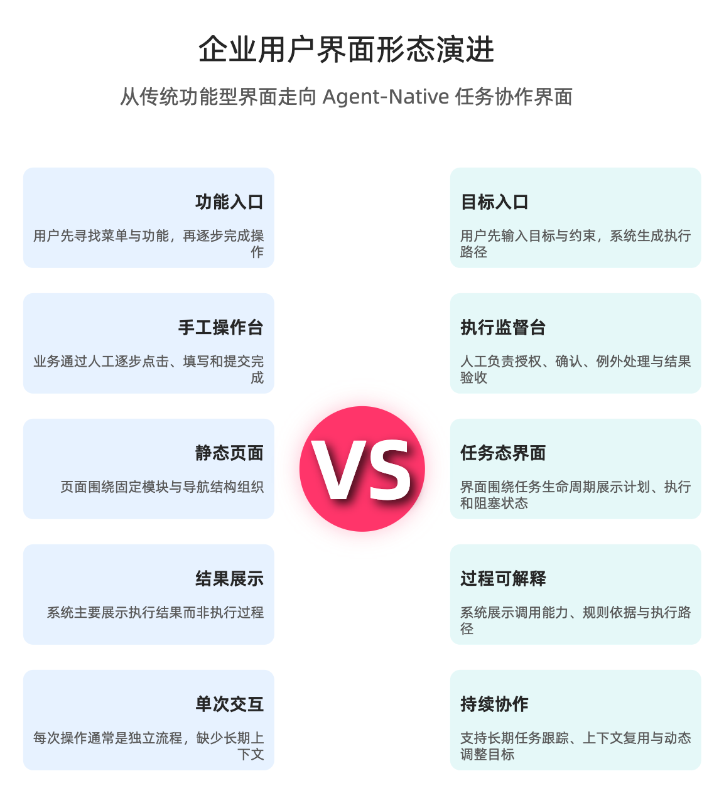
_图：新人机协同界面从“功能入口”转向“目标入口”，并围绕任务生命周期提供可解释、可监督的执行协同能力。_

这五个变化共同指向同一个事实：人机协同界面的核心价值，正在从“提升单次操作效率”转向“保障持续执行质量与可控性”。

### 4.2 典型场景一：电网异常告警处置闭环

在传统电力运检与调度场景中，一次设备异常告警往往需要运行值班员在告警平台、SCADA、设备台账、缺陷管理平台和工单平台之间反复切换，人工完成告警核验、影响范围判断、处置建议查询、抢修工单发起和结果回写。流程跨系统、信息碎片化、对经验依赖强，是典型的高时效人工串联场景。

在 Agent-Native 应用形态下，运行值班员不再需要手工串起全部系统，而是给出目标和边界，例如“优先保障重要负荷，按调度规程完成异常研判与处置闭环”。随后 Agent 自动汇聚实时遥测、设备历史缺陷、检修计划和运行规程，判断异常等级、生成处置建议、发起工单或消缺流程，并在涉及停电操作、负荷转供和高风险动作时请求人工确认。人从“信息搬运者”逐步转变为“策略确认者”和“责任把关者”。

这类场景的价值不只在于提效，更在于把原本依赖资深运行值班员个人经验的判断路径沉淀为可复用能力。告警聚类、影响范围评估、处置预案匹配、抢修资源协同、结果回写等动作，会逐步被抽象为能力节点，供不同调度与运检 Agent 在不同链路中复用。

### 4.3 典型场景二：电网调度辅助决策与执行协同

电力调度本质上是典型的多源信息决策场景：既依赖实时负荷、潮流断面、设备运行方式和气象信息，也受制于安全约束、调度规程、检修计划和保供要求。传统系统能够提供大量数据，但很难在高变化环境下持续完成跨系统分析与执行协同，最终仍然依赖调度员人工研判和多系统操作。

未来的 Agent-Native 调度辅助系统，更像一个“持续运行的调度执行单元”。它能够持续监测关键断面、识别负荷异常波动、读取检修与方式计划、生成负荷转移或运行方式调整建议、核对安全校验结果，并在越限风险、重要用户保供或跨区协同时自动触发审批与会商流程。调度员的角色从“盯盘、查数、分发指令”转向“设定边界、确认例外、审核关键动作”。

这类场景尤其能体现“以 Agent 为中心”的架构理念。系统的核心不再是给人展示更多曲线和报表，而是让 Agent 直接消费实时运行数据、规则和约束，围绕“保安全、保供电、保稳定”这一调度目标持续执行。对工程团队而言，真正重要的交付物不再只是监控界面，而是状态查询、校核计算、预案匹配、指令生成、执行确认等一组可被 Agent 调用的能力底座。

### 4.4 典型场景三：输变电设备运检与检修协同

输变电设备运检通常横跨生产管理系统、状态监测平台、巡检系统、缺陷管理平台、物资系统和检修计划，是另一个高复杂度业务链路。传统系统能够记录巡视结果、在线监测数据和缺陷台账，却很难在业务推进层形成持续闭环，因此现场运维、运检专责和检修班组之间仍然需要大量人工协调。

在 Agent-Native 形态下，系统可以围绕“提前识别设备风险、优化检修安排、缩短缺陷闭环周期”这一目标持续运行。Agent 自动分析在线监测趋势、比对历史缺陷和同类设备案例、识别高风险设备、生成检修优先级建议、核对物资与停电窗口、发起检修计划或消缺任务，并把结果同步回设备台账、计划系统和运检看板。原本需要多个岗位频繁切换系统完成的动作，会逐步被能力化并纳入统一执行链路。

这类场景也说明，Agent-Native 并不意味着“完全无人化”。在重要设备停役、复杂倒闸操作、人身安全风险和大范围方式调整等场景下，人工仍然是最终责任主体。但系统的组织方式已经改变：人工不再逐步搬运信息，而是在关键节点介入，处理高风险和高价值决策。

### 4.5 场景共性：哪些任务最适合 Agent-Native

并不是所有电力业务都需要优先做成 Agent-Native。最适合率先落地的，通常是四类任务：第一，跨系统且信息分散的任务，例如告警研判、缺陷闭环、检修协同；第二，规则存在但异常分支较多的任务，例如方式调整建议、风险分级与工单流转；第三，目标明确但路径需要动态调整的任务，例如保供期间的负荷优化与抢修资源调度；第四，结果必须形成执行闭环而不是停留在分析建议的任务。

相反，那些高度确定、边界固定、已经被安控系统、规则引擎或传统 Workflow 稳定覆盖的任务，不一定要优先交给 Agent。Agent-Native 不是要取代电力生产中的既有自动化体系，而是补足传统系统在人机分工中的空白地带，把原本依赖人工协调、系统之间缺少执行闭环的部分，逐步转化为可治理的机器执行网络。

### 4.6 章节小结

第4章回答的不是“系统该怎么实现”，而是“企业为什么需要这样一种新形态的应用”。未来的 Agent-Native 企业应用，将不再只是人使用软件，而是人设定目标与约束、Agent 代表组织持续执行动作、系统围绕能力网络提供支撑。对工程团队而言，这意味着软件开发的重点将逐步从页面与流程，迁移到能力产品化、上下文供给、执行控制与治理闭环。

带着这张目标蓝图，下一章才可以继续讨论一个更具体的问题：如果企业真的要建设这样的系统，应遵循哪些基础原则。

<a id="chapter-05"></a>
## 第5章 Agent-Native 设计原则

很多企业在 Agent 项目中都会遇到同一个问题：试点阶段演示效果很好，但一进入跨部门、跨系统和合规场景，系统就开始变脆。原因并不复杂，试点关注的是“模型是否会回答”，而规模化关注的是“系统是否可持续运行”。前者追求局部体验，后者追求长期稳定、跨团队复用和风险可控，两者并不在同一层面。

这也是为什么很多看似成功的 PoC，到了生产环境就迅速暴露问题。模型回答得不错，并不意味着系统真的可执行；工具能被调用一次，并不意味着能力可被稳定复用；任务能跑通一条 happy path，并不意味着遇到异常、权限变化和接口升级时还能继续工作。Agent-Native 的难点，从来不是把模型“接进去”，而是把智能嵌入企业级工程体系。

因此，第5章给出四条 Agent-Native 设计原则，它们不是理论口号，也不是互相独立的最佳实践清单，而是企业架构从 PoC 走向生产级的最小共识。四条原则共同回答一个问题：如果希望 Agent 从“偶尔能跑通”变成“长期能运行”，系统底座需要先满足什么条件。

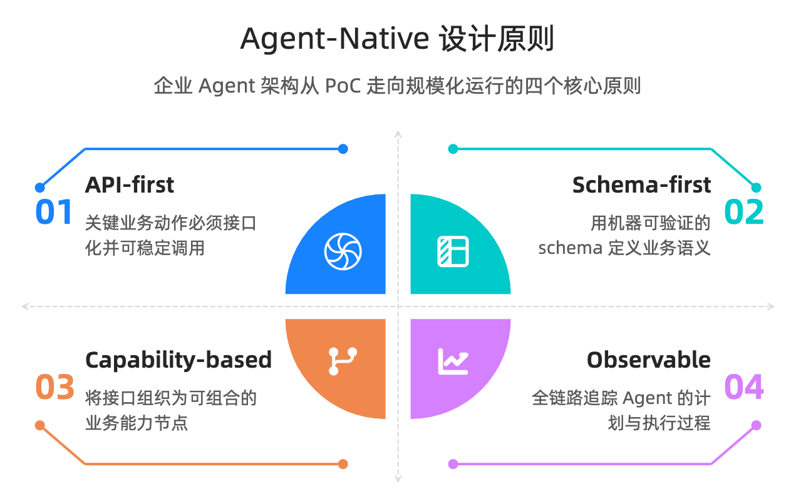
_图：从 PoC 到生产级系统所需的四条 Agent-Native 设计原则。_

### 5.1 API-first: 能力接口化

Agent 的执行前提是“可调用”。如果关键业务动作仍然被锁在页面按钮、人工表单和临时脚本中，Agent 即使理解任务，也无法稳定落地。API-first 的本质不是“多建几个接口”，而是把真实业务动作以可治理的方式暴露出来。

API-first 要解决的，首先不是“系统之间能不能通信”，而是“业务动作能不能被机器稳定触发”。在传统企业系统里，很多真正关键的动作其实藏在页面逻辑、人工审批、批处理脚本和部门习惯中。人可以绕过这些隐性路径完成任务，Agent 不行。对 Agent 来说，凡是不能被显式调用、不能被稳定授权、不能被清晰返回结果的动作，都不能算真正可执行能力。

企业在推进 API-first 时，建议优先改造高频、高价值、可复用的核心动作，例如实时状态查询、缺陷工单发起、检修审批触发、调度指令确认，而不是从边缘功能入手。这样可以更快形成可复用能力池，并验证跨流程编排价值。选择这类动作还有一个现实好处：它们通常跨越多个业务链路，一旦接口化，就能在多个 Agent 场景里复用，而不是只服务单个试点项目。

此外，API-first 不能只停留在“把功能暴露成 HTTP 端点”。如果接口没有稳定的权限模型、版本策略、错误语义和生命周期管理，Agent 仍然无法在生产环境中长期依赖这些能力。换句话说，API-first 的真正含义是把业务动作变成“可调用、可授权、可演进、可追踪”的正式契约，而不是临时接线。

因此，API-first 必须配套版本治理和兼容策略。Agent 一旦进入生产环境，会依赖接口语义长期运行。如果接口频繁破坏性变更，Agent 行为将变得不可预测。这不是单纯的“开发规范问题”，而是直接的运营风险。很多 Agent 项目后期不稳定，本质上不是模型出了问题，而是底层能力接口从来没有被当作长期产品来经营。

示例：一个“电网异常告警处置”Agent 想要自动推进异常闭环，至少需要稳定调用“查询实时遥测”“查询设备台账”“匹配处置预案”“发起消缺工单”“通知运行值班员”等动作。如果这些动作仍然分散在监控页面按钮、线下电话确认和各系统内部操作里，Agent 最多只能给出处置建议，无法真正执行。只有把这些动作正式接口化，并定义好权限、返回结果和异常语义，Agent 才能从“辅助分析者”变成“执行协同者”。

这里的 OpenAPI 指 OpenAPI Specification（OAS）3.0.3，用于以机器可读方式定义 API 契约（路径、参数、请求/响应、schema）。

一个更接近生产的 API-first 示例，应先给出可生成 SDK 的 OpenAPI 契约，并显式定义幂等与状态约束：

```yaml
openapi: 3.0.3
paths:
  /v1/grid/work-orders:
    post:
      operationId: createGridWorkOrder
      parameters:
        - in: header
          name: Idempotency-Key
          required: true
          schema: { type: string, minLength: 8 }
      requestBody:
        required: true
        content:
          application/json:
            schema:
              $ref: '#/components/schemas/CreateWorkOrderRequest'
      responses:
        '200':
          description: created or deduped
          content:
            application/json:
              schema:
                $ref: '#/components/schemas/WorkOrder'
        '400':
          description: INVALID_ARGUMENT (do not retry)
          content:
            application/json:
              schema:
                $ref: '#/components/schemas/ErrorResponse'
              examples:
                invalidArgument:
                  value:
                    code: INVALID_ARGUMENT
                    message: severity must be one of low|medium|high|urgent
                    retryable: false
        '404':
          description: NOT_FOUND (context may be wrong)
          content:
            application/json:
              schema:
                $ref: '#/components/schemas/ErrorResponse'
        '401':
          description: UNAUTHORIZED (missing or invalid token)
          content:
            application/json:
              schema:
                $ref: '#/components/schemas/ErrorResponse'
        '403':
          description: FORBIDDEN (permission/scope not enough)
          content:
            application/json:
              schema:
                $ref: '#/components/schemas/ErrorResponse'
        '409':
          description: CONFLICT (read latest state then retry)
          content:
            application/json:
              schema:
                $ref: '#/components/schemas/ErrorResponse'
        '503':
          description: TRANSIENT (retry with backoff)
          content:
            application/json:
              schema:
                $ref: '#/components/schemas/ErrorResponse'
```

### 5.2 Schema-first: 机器可理解的业务契约

传统接口文档很多是“给人看”的，留给机器的只是弱结构描述。Agent 系统需要相反的优先级：先定义机器可验证的 schema，再提供人类可读说明。输入参数、字段含义、枚举范围、错误语义、幂等规则，都应成为结构化契约的一部分。

Schema-first 的本质，是把“业务语义”从文档说明和开发者经验中抽出来，变成机器可校验、平台可治理、团队可协作的正式结构。没有 schema，Agent 只能根据上下文去猜字段含义、参数范围和返回状态；一旦猜错，结果往往不是调用失败，而是更危险的“调用成功但业务含义错误”。

Schema-first 的价值在于显著降低 Agent 的调用不确定性。没有 schema，Agent 依赖上下文猜测；有 schema，Agent 可以进行参数校验、失败重试和路径切换。特别是在多团队协作场景中，schema 是跨系统协同的“共同语言”，能减少大量隐性沟通成本。它把过去依赖资深开发者脑内知识才能处理的问题，前置为结构化约束。

对于企业治理层，schema 还有第二层意义：它让“质量基线”变得可自动化。测试、监控、审计都可以围绕 schema 建立规则，不再依赖人工经验兜底。字段缺失、枚举非法、返回结构漂移、破坏性变更等问题，都可以更早被平台发现，而不是等到 Agent 在线上任务里“表现异常”时才被动排查。

从落地顺序看，Schema-first 也决定了企业能否从单点集成走向规模复用。没有统一 schema，每接一个新系统几乎都要重新解释一遍字段与语义；有了 schema，接入成本才可能随着平台成熟而下降，而不是随着系统数量增加而线性失控。

示例：同样是“消缺工单状态”字段，有的系统返回 `created/dispatched/completed`，有的系统返回 `0/1/2`，有的系统还会出现 `waiting_shift_confirmation`。对人来说，这些差异可以靠经验理解；对 Agent 来说，如果没有统一 schema 和枚举说明，就可能把“待运行值班员确认”误当成“已派发”，进而触发后续执行。Schema-first 的作用，就是把这类隐性语义差异提前变成显式约束。

一个最小 Schema-first 示例，可以直接在 OpenAPI `components/schemas` 中把输入、输出和错误语义一起收敛：

```yaml
components:
  schemas:
    CreateWorkOrderRequest:
      type: object
      required:
        - alarmId
        - substationId
        - equipmentId
        - alarmType
        - severity
        - requestedAction
        - requestedBy
      properties:
        alarmId: { type: string, pattern: '^ALM-[0-9]{8}-[0-9]{3}$' }
        substationId: { type: string }
        equipmentId: { type: string }
        alarmType: { type: string }
        severity: { type: string, enum: [low, medium, high, urgent] }
        requestedAction: { type: string, enum: [dispatch_field_inspection, remote_recheck] }
        requestedBy: { type: string, pattern: '^agent\..+' }
      additionalProperties: false

    WorkOrder:
      type: object
      required: [workOrderId, status, equipmentId, updatedAt, traceId]
      properties:
        workOrderId: { type: string, pattern: '^WO-[0-9]+$' }
        status:
          type: string
          enum:
            - created
            - pending_dispatch_review
            - dispatched
            - waiting_shift_confirmation
            - completed
        equipmentId: { type: string }
        dispatchPriority: { type: string, enum: [low, medium, high, urgent] }
        traceId: { type: string }
        updatedAt: { type: string, format: date-time }
      additionalProperties: false

    ErrorResponse:
      type: object
      required: [code, message, retryable]
      properties:
        code:
          type: string
          enum:
            - INVALID_ARGUMENT
            - UNAUTHORIZED
            - FORBIDDEN
            - NOT_FOUND
            - TRANSIENT
            - CONFLICT
        message: { type: string }
        retryable: { type: boolean }
        retryAfterMs: { type: integer, minimum: 0 }
        traceId: { type: string }
      additionalProperties: false
```

### 5.3 Capability-based: 从接口清单到能力系统

API 解决的是“怎么调”，Capability 解决的是“能做什么”。面向 Agent 的企业架构如果停留在接口层，最终会遇到组合困难：接口数量越来越多，自动编排却越来越难。Capability-based 的目标是把离散接口组织成可规划、可组合、可治理的能力节点。

Capability-based 要解决的是“接口很多，但业务仍然做不完”的问题。企业系统常见状态是 API 数量持续增长，但真正可以被 Agent 稳定编排的业务动作却很少。原因在于接口只是技术暴露，能力才是业务抽象。没有能力层，Agent 看到的是大量分散端点；有了能力层，Agent 看到的才是可以组合成任务路径的业务节点。

一个能力节点通常至少包含六类要素：目标语义、输入输出 schema、前置条件、执行约束、失败语义和审计信息。这样定义后，Agent 才能在复杂任务中进行可靠规划，例如判断是否满足调用前提、失败后是否允许重试、结果是否需要人工确认。能力节点的价值，不只是提高调用成功率，更是把“业务可完成性”做成显式资产。

当企业形成 Capability Layer 后，系统边界会从“按应用划分”逐步转向“按能力划分”。这并不要求替代现有系统，而是在现有系统之上建立统一能力抽象层，把“业务可执行性”从具体应用中解耦出来。这样一来，新流程的构建不再总是意味着新一轮系统对接，而更像是在既有能力网络上做新的组合与约束配置。

更重要的是，Capability-based 让治理可以前置到能力层。权限、风控、审计、版本和责任归属不必等到流程编排阶段才零散拼接，而可以随着能力定义一起沉淀。这正是 Agent 架构区别于传统“接口堆砌式集成”的关键分水岭。

示例：在输变电设备运检场景中，“查询在线监测趋势”“查询历史缺陷”“生成检修建议”“创建消缺工单”“升级运检专责复核”如果只是五个 API，Agent 仍然需要自己猜先后顺序和切换条件；如果它们被组织成能力节点，并定义“风险等级达到高才允许触发检修建议”“涉及主设备停役必须先人工复核”，Agent 才能在约束内稳定编排，而不是靠试错碰运气。

一个最小 Capability-based 示例，建议与能力目录/Resolver 保持一致，采用统一能力清单 JSON：

```json
{
  "id": "maintenance.defect.disposal",
  "name": "Defect Disposal",
  "domain": "maintenance",
  "version": "1.2.0",
  "description": "推进设备缺陷闭环，并在高风险场景升级专业复核。",
  "inputSchema": {
    "$ref": "schemas/maintenance.defect.disposal.input.json"
  },
  "outputSchema": {
    "$ref": "schemas/maintenance.defect.disposal.output.json"
  },
  "owner": "production.maintenance-center@company.com",
  "policy": {
    "risk": "high",
    "requires": [
      "scope:maintenance:defect:write",
      "scope:dispatch:review"
    ],
    "approvalRules": [
      {
        "when": "riskLevel in ['high','urgent']",
        "require": "dispatcher_approval"
      }
    ],
    "rateLimit": {
      "rps": 5
    }
  },
  "deps": [
    "equipment.query_defect_history",
    "monitoring.query_realtime_signal",
    "maintenance.create_repair_order"
  ],
  "tags": [
    "defect",
    "repair",
    "grid",
    "write"
  ]
}
```

### 5.4 Observable: 决策与执行可追踪

Agent 架构的最大风险之一是“看起来在工作，但不知道为什么这样工作”。在企业环境里，不可观测就不可治理。Observable 原则要求从第一天起，把 Agent 的计划、工具调用、上下文版本、成本消耗、异常分支和最终结果纳入统一追踪。

Observable 的重点不是“多打一层日志”，而是让每一次任务执行都能被解释、分析和追责。传统系统的可观测性更多关注服务是否可用，而 Agent 系统的可观测性必须进一步回答：为什么做出这个决策、调用了哪些能力、使用了哪一版上下文、在哪一步发生偏差、为什么转人工、最终业务结果是否符合预期。

可观测性不应只服务于排障，也服务于运营优化和风险控制。例如同一任务在不同部门执行成功率差异、某类能力节点的失败热点、某条策略导致的高频人工接管，都可以成为持续优化的依据。没有这类数据，团队很难判断问题到底来自模型、能力定义、接口质量、策略规则，还是任务编排本身。

当可观测性成为架构内建能力，企业才能从“能跑一次”走向“稳定反复跑”。它一方面为治理提供证据链，另一方面也为平台化运营提供反馈闭环。成功率、人工接管率、平均任务成本、异常类型分布，最终都会成为优化能力层和 Runtime 的核心输入。

这也是 Agent 系统进入核心业务的必要条件。没有可观测性，企业对 Agent 的信任只能建立在“感觉它好像还能用”之上；而在生产环境里，任何不能被解释的自动化，最终都很难被真正授权。

示例：一个调度辅助 Agent 给出“建议对 220kV 断面执行负荷转移”的结论，调度团队真正关心的不只是结果本身，而是它基于哪一版潮流数据、调用了哪些校核能力、是否考虑了检修方式、为什么选择负荷转移而不是调整运行方式、在哪个安全阈值下触发了建议。只有这些信息可追踪，团队才能判断这次建议是否可信，也才能在结果偏差时快速定位问题来源。

一个最小 Observable 示例可以记录为结构化事件：

```json
{
  "traceId": "trace-dispatch-001",
  "taskId": "task-dispatch-20260306-01",
  "agent": "agent.dispatch-assistant",
  "objective": "为220kV关键断面生成调度调整建议",
  "inputs": {
    "sectionId": "SEC-220KV-08",
    "loadWindow": "2026-03-06T10:00:00+08:00/2026-03-06T11:30:00+08:00",
    "operationModeVersion": "mode-v12"
  },
  "decision": {
    "recommendedAction": "load_transfer",
    "targetLoadMw": 120,
    "reasonCodes": [
      "section_limit_near_breach",
      "planned_maintenance_impact"
    ]
  },
  "toolCalls": [
    {
      "tool": "dispatch.get_realtime_section_load",
      "status": "success",
      "latencyMs": 120
    },
    {
      "tool": "dispatch.run_security_check",
      "status": "success",
      "latencyMs": 185
    }
  ],
  "policyChecks": [
    {
      "policy": "cross_region_adjustment_requires_review",
      "result": "triggered"
    }
  ],
  "outcome": {
    "status": "pending_dispatcher_review"
  },
  "timestamp": "2026-03-06T11:45:00+08:00"
}
```

### 5.5 章节小结

四条原则可以总结为一条工程路径：先把业务动作接口化（API-first），再把语义结构化（Schema-first），再把系统能力化（Capability-based），最后把运行过程透明化（Observable）。这个顺序并不是教条，而是因为它对应了 Agent 落地中最常见的四个失败源：无能力可调、语义无法校验、接口难以组合、运行无法解释。

所谓 Agent-Native，并不是“把模型接进现有系统”这么简单，而是让系统逐步具备四种面向机器执行的基础属性：可调用、可理解、可规划、可观测。任何跳过中间环节的“捷径”，都会在规模化阶段以更高成本补课。

第6章将在这四条原则基础上进一步回答一个更具体的问题：如果把这些原则真正落成企业架构，系统整体应该长成什么样。

<a id="chapter-06"></a>
## 第6章 参考架构：从应用分层到能力分层

有了设计原则，下一步是建立可落地的目标蓝图。这里给出一个企业可采用的五层参考架构：Interface Layer、Capability Layer、Data & Knowledge Layer、Runtime & Orchestration Layer、Security & Governance Layer。它不是强绑定某家厂商或某种模型的产品图，而是一种可以渐进落地的结构框架。

这一章的重点，不是再列一张“技术分层图”，而是回答一个更实际的问题：当企业希望 Agent 从单点助手演进为可持续运行的执行网络时，系统整体应当如何组织。传统应用架构更强调系统边界、菜单入口和流程模块；而面向 Agent 的目标架构更强调能力暴露、上下文供给、任务执行和治理闭环。两者并不是简单替换关系，而是系统重心的转移。

理解这套五层架构时，一个很有用的视角是把它看成一条完整的执行链路：Interface Layer 让能力可接入，Capability Layer 让能力可规划，Data & Knowledge Layer 让执行建立在可信上下文上，Runtime & Orchestration Layer 让任务真正跑起来，Security & Governance Layer 则把风险控制嵌入整条路径。缺任何一层，Agent 都可能“能理解但不能做”“能做一次但不能持续做”“能跑通但不能放心上线”。

从设计哲学上看，这套五层架构也是“以人为中心”向“以 Agent 为中心”迁移的工程体现。传统企业系统首先思考的是“用户看到什么页面、点击什么按钮、走什么流程”；而 Agent-Native 架构首先思考的是“企业有哪些能力可被供给给 Agent、这些能力如何被安全调用、如何被编排成结果”。因此，这五层本质上是在回答一个新问题：如何把企业软件从面向人操作的系统，重构为同时面向人协同和 Agent 执行的能力系统。

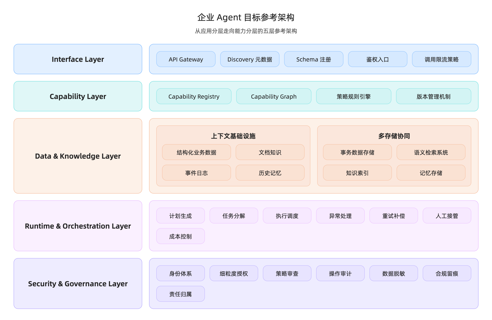
_图：面向企业 Agent 的五层参考架构总览。_

### 6.1 Interface Layer: 统一接入面

Interface Layer 的职责是把分散系统转化为“机器友好”的接入面。它通常包括 API Gateway、Discovery 元数据、Schema 注册、鉴权入口和调用限流策略。

这层的关键不是流量转发，而是语义统一。若不同系统各自维护文档风格和错误模型，Agent 会持续为“理解差异”付出代价。统一接口层后，Agent 可以通过一致方式完成能力发现、参数构造和执行反馈处理。Interface Layer 要解决的核心问题，是“Agent 如何稳定地连上企业世界”。

从架构角色上看，Interface Layer 更像 Agent 的“统一接线板”。它不直接承载复杂业务编排，但负责把底层异构系统暴露成可发现、可调用、可鉴权、可限流的标准接入面。没有这一层，Agent 对企业系统的调用往往会退化为点对点对接，后期维护成本极高。

例如，在一个“电网异常处置”场景中，Agent 需要访问 SCADA、设备台账、缺陷管理平台、工单平台四个系统。如果每个系统都有不同的鉴权方式、错误格式和字段风格，Agent 每接一个系统都要重新适配一遍；而统一到 Interface Layer 后，这些差异可以先在平台层被收敛，Agent 只需要面向一致的接入约定工作。

### 6.2 Capability Layer: 能力编排层

Capability Layer 是整个架构的中枢。它向上承接 Agent 的任务意图，向下映射具体系统接口，并在中间施加业务约束与组合逻辑。实践上，这一层往往由 Capability Registry、Capability Graph、策略规则引擎和版本管理机制构成。

它的核心价值是“降复杂度”。对 Agent 来说，不需要理解每个系统的全部实现细节，只需要理解能力节点的标准语义；对企业来说，不需要每次新增流程都重写集成逻辑，而可以复用既有能力节点做动态编排。Capability Layer 解决的不是系统能不能调用，而是业务目标能不能被可靠完成。

在很多企业里，接口已经不少，但真正能被自动完成的业务任务仍然很少，原因就在于接口和业务目标之间缺了一层抽象。Capability Layer 正是这层抽象：它把“查询实时遥测”“校核运行方式”“发起检修审批”“发送告警通知”这类动作组织成可被 Agent 规划和治理的业务能力网络。

例如，在“主设备异常处置”场景里，Agent 面对的不应只是十几个底层 API，而应是“核验实时状态”“判断风险等级”“创建消缺工单”“同步运行值班员通知”这类能力节点。这样，Agent 的规划对象就从技术端点变成业务动作，编排正确率和复用性都会明显提高。

### 6.3 Data & Knowledge Layer: 上下文基础层

企业 Agent 的执行质量高度依赖上下文完整性。Data & Knowledge Layer 负责把结构化业务数据、文档知识、事件日志和历史记忆统一组织，支持实时查询与语义检索。

这层通常不是“单一数据库”，而是多存储协同：事务数据保证一致性，检索系统提供语义召回，知识索引管理非结构化信息，记忆存储维护跨任务连续性。关键在于建立统一访问策略和数据新鲜度机制，避免 Agent 在过期或冲突数据上做决策。

Data & Knowledge Layer 解决的是“Agent 凭什么做判断”。很多 Agent 失败并不是不会推理，而是拿到的上下文不完整、不一致或已经过期。没有可信上下文，再好的规划和执行也可能建立在错误事实之上。

例如，一个调度辅助 Agent 既要读取实时潮流和负荷预测，也要理解检修计划、运行规程和历史处置经验。这些信息分别分布在实时数据平台、分析系统、知识文档和记忆存储中。Data & Knowledge Layer 的作用，就是把这些分散信息组织成对任务真正有用的上下文，而不是让 Agent 自己在多个系统中“边找边猜”。

### 6.4 Runtime & Orchestration Layer: 执行控制层

Runtime & Orchestration Layer 决定系统是否具备企业级可靠性。它负责计划生成、任务分解、执行调度、异常处理、重试补偿、人工接管和成本控制。

在这一层，需要明确“哪些决策可自动执行，哪些决策必须人工确认”。同时要把任务生命周期做成状态化流程，而不是一次性调用。只有这样，Agent 才能在长链路任务中保持可控和可恢复。

如果说前面三层解决的是“能不能理解、能不能接入、能不能规划”，那么 Runtime & Orchestration Layer 解决的就是“任务最终能不能交付结果”。这层把模型能力、工具调用、状态管理和人工接管放到统一控制平面中，避免 Agent 退化为一次性推理器。

例如，在“跨系统异常处置”场景中，任务可能需要先校验遥测异常，再判断设备风险等级，随后发起工单、等待调度确认、更新处置状态并通知运行值班员。这里任何一步超时、失败或权限不足，都不能让任务直接消失，而应进入重试、补偿或转人工状态。Runtime 层的存在，就是把这些长链路执行做成可控流程，而不是把成败交给一次模型输出。

### 6.5 Security & Governance Layer: 安全与治理层

Security & Governance Layer 贯穿其他四层。核心能力包括身份体系、细粒度授权、策略审查、操作审计、数据脱敏、合规留痕和责任归属。

传统系统中，安全常被视为外围能力；在 Agent 架构中，安全必须是执行路径的一部分。每一次能力调用都应可鉴别主体、可验证权限、可追溯结果。否则，自动化程度越高，潜在风险越大。

这一层的意义在于，把“能不能上线”变成架构内建属性，而不是项目后期的补丁。Agent 一旦具备跨系统执行能力，权限误配、数据越权、审计缺失和责任不清都会被成倍放大。Security & Governance Layer 的作用，就是让身份、策略、审计和合规要求从第一天起就内嵌进执行链路。

例如，在“重要设备停役审批”场景中，系统应能明确判断这次动作由哪个 Agent 发起、代表谁执行、是否命中高风险策略、是否必须调度长确认、最终责任归属给谁。如果这些问题不能被系统实时回答，企业通常不会允许 Agent 进入核心业务闭环。

### 6.6 五层架构的落地特征

这套五层架构具备三个现实特征。第一，增量演进：可从单条业务链路开始，不要求一次性重构。第二，技术中立：可兼容不同模型、不同编排框架和不同数据平台。第三，治理优先：从一开始就把可观测性与安全放进架构主线，而非后补。

所谓增量演进，意味着企业完全可以先选一条高价值链路做样板间，例如异常告警闭环、调度辅助决策、设备缺陷治理，而不是试图一次性重做所有系统。五层架构不是要求五层同时大而全，而是要求每一层都先有最小可用能力，并能随着业务扩展而逐步增强。

所谓技术中立，意味着这套结构关注的是职责边界，而不是某个产品清单。企业可以在不同层选择不同供应商、开源组件和自研模块，只要职责划分清楚，就不会因为底层技术替换而把整体架构打散。

所谓治理优先，则意味着 Agent 项目从第一天起就要回答“如何审计、如何授权、如何追责、如何观测”。如果这些能力等到试点跑通之后再补，往往会发现系统的执行链路、能力定义和数据流向都已经固化，补课成本极高。

### 6.7 章节小结

如果说第5章回答的是“该按什么原则建设”，第6章回答的是“系统最终应该长什么样”。从应用分层到能力分层，并不是概念替换，而是企业 IT 主体逻辑的变化：软件不再只是承载页面和流程，更是向 Agent 持续输出可执行能力。

用更直接的话说，这五层分别回答了五个问题：怎么连上系统，怎么组织能力，怎么提供上下文，怎么稳定执行，怎么确保可控。只有这五个问题同时被回答，企业才可能把 Agent 从局部增强工具，推进为组织级执行底座。

后续几章将按层展开：第7章讨论 Interface，第8章讨论 Capability，第9章讨论 Data 与 Memory，第10章讨论 Runtime，第11章讨论安全与治理。也就是说，第6章给出的是总图，后面几章会把这张总图逐层拆开。

<a id="chapter-07"></a>
## 第7章 Interface 层：Agent 执行的统一接入面

说明：本章结论默认适用于中大型企业、治理与审计优先、已有 REST/API 资产较多的生产环境；若场景是个人自动化、研发工具链或强 CLI 传统环境，接口取舍可以不同。

在五层架构中，Interface Layer 是最容易被低估的一层。很多团队认为“只要有 API 就够了”，但实际落地中，Agent 的失败大量发生在接口层：找不到能力、参数构造错误、异常语义不一致、权限握手复杂。Interface 层一旦不稳定，后面的 Capability、Runtime、治理设计都会被拖累，因为 Agent 连“正确地连上系统”都做不到。

这也是为什么第7章值得单独展开。对人类开发者而言，接口问题往往还能靠经验、文档、群沟通和临场修补解决；对 Agent 而言，接口必须先天具备可发现、可验证、可审计的特征，否则模型再强，也只能在错误输入、模糊语义和脆弱接入上碰运气。第7章聚焦一个核心问题：什么样的接口体系，才能支持 Agent 在企业环境中稳定执行。

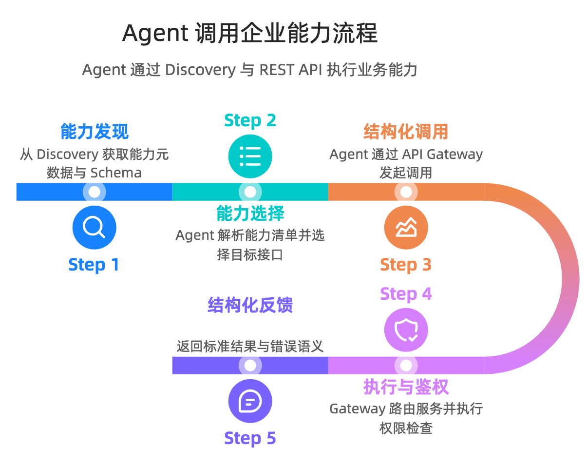
_图：Interface 层常见失败点，以及为何需要 Discovery 与 Schema 辅助 Agent 稳定执行。_

### 7.1 CLI 作为主接口的局限

CLI 对工程师高效，但对 Agent 并不天然友好。第一，输出多为非稳定文本，解析成本高且容易受版本变化影响；第二，参数与上下文常依赖隐式约定，不利于机器自动构造；第三，权限和审计链路通常分散，难以满足企业治理要求。

CLI 在本地调试和运维操作中仍有价值，但不宜作为企业级 Agent 主执行接口。企业要追求的是“可发现、可验证、可审计”的结构化调用面，这与 CLI 的设计目标并不一致。

更本质的原因在于，CLI 是为“熟悉上下文的人”设计的，而不是为“需要在运行时自解释的机器执行体”设计的。一个经验丰富的工程师看到 `--force`、`--dry-run`、`--env prod` 之类参数时，知道它们意味着什么、风险有多大、什么时候不该用；但 Agent 如果缺少显式元数据和结构化约束，很难稳定推断这些隐含语义。

此外，CLI 常常把业务能力、执行环境和人工操作习惯耦合在一起。它可能依赖本地配置、环境变量、当前目录、输出格式甚至操作者经验，这些都不适合作为生产级 Agent 的长期执行基础。企业当然可以保留 CLI 用于运维和人工兜底，但如果把它当成主接口，系统就会在解析稳定性、权限治理和审计一致性上持续吃亏。

### 7.2 REST + Discovery + Schema: 现实组合

对大多数企业来说，最现实的路线不是全盘替换现有接口，而是在 REST 体系上叠加 Discovery 与 Schema 能力。REST 提供广泛兼容性和成熟工程生态；Discovery 解决“能力在哪里、如何变化”；Schema 解决“参数怎么填、结果怎么判”。

在这套组合下，Agent 的执行链路会从“猜接口”变成“按元数据调用接口”。典型流程是：先读取能力元数据，再选择目标端点并完成参数校验，最后根据结构化结果执行后续动作。其收益不仅体现在调用成功率，也体现在开发效率和治理一致性。

之所以强调这是“现实组合”，是因为它充分利用了企业已经广泛存在的 REST 资产，同时补上了 REST 本身对 Agent 不够友好的部分。单纯 REST 解决的是“有端点可调”，但没有回答“Agent 如何知道该调哪个、字段含义是什么、失败后该怎么办”；Discovery 和 Schema 则正好补上这些缺口。

从落地成本上看，这种组合也明显优于“推倒重来”。企业不必先重构所有存量系统，只需要先在现有 API 之上补 Discovery 元数据、Schema 契约和统一接入治理，就能让已有接口逐步变成 Agent 可消费的能力入口。这也是大多数企业真正能走通的路径。

### 7.3 Discovery 机制的企业作用

Discovery 的核心价值是让新 Agent 能在运行时理解企业能力版图，而不是依赖大量手工接线。无论具体实现命名为何，本质都包括三件事：能力清单可获取、接口语义可解释、变更状态可感知。

当企业服务规模扩大后，Discovery 机制会直接影响集成成本。没有统一发现机制，每新增一个 Agent 都要重复对接；有了统一发现机制，新 Agent 可以复用既有接入路径，在统一约束下快速上线。这也是“从项目交付”走向“平台化运营”的关键分水岭。

可以把 Discovery 理解成 Agent 世界里的“能力导航层”。它不是简单目录页，而是运行时控制平面的一部分：Agent 通过它理解有哪些能力可用、这些能力适用于什么场景、当前版本是什么、是否下线、失败语义如何定义。没有 Discovery，Agent 对企业能力的理解只能靠静态配置和人工维护，很难适应持续变化的系统环境。

对于企业平台团队来说，Discovery 还有一个更深层的价值：它把原本分散在文档、口口相传和历史经验中的接入知识，沉淀成平台资产。一旦这种资产形成，新增 Agent 不再从零开始理解系统版图，而是从统一能力视图出发做规划和接入。

### 7.4 MCP 与企业 API 体系的协同

在实践中，MCP 可以作为 Agent 侧工具暴露协议，而企业内部核心交易仍以 REST/API 网关体系为主。两者不是二选一关系，更合理的方式是分层协同：Agent 侧通过 MCP 获得一致工具调用体验，企业侧通过 REST/Schema/Gateway 保持治理与稳定性。

当 MCP 工具最终映射到企业 API 时，仍应遵循统一 schema、权限校验、审计留痕和版本策略。这样做可以避免“Agent 端便利、企业端失控”的双轨风险。

这里最重要的判断是：MCP 更适合解决 Agent 侧工具接入体验的一致性，而 REST/API Gateway 更适合解决企业侧治理与生命周期管理的一致性。前者偏调用协议，后者偏企业控制面。把两者放在各自擅长的位置，系统既能获得 Agent 友好的工具抽象，又不会牺牲企业长期要求的可控性。

反过来说，如果企业把 MCP 直接当成内部核心交易接口的唯一治理边界，就可能把模型侧便利误当成企业级接口治理；而如果完全忽略 MCP，又可能错过 Agent 工具调用的一致体验。更合理的方案仍然是分层协同，而不是协议替代。

### 7.5 Interface 层工程要点

Interface 层要真正支撑生产环境，至少应满足以下工程要点：

1. 能力元数据统一注册，支持版本与下线策略。  
2. 输入输出 schema 机器可校验，错误语义标准化。  
3. 鉴权和授权与企业身份体系打通，支持细粒度策略。  
4. 调用链可追踪，能够关联到任务、主体与业务结果。  
5. 变更可观测，接口语义变化能提前预警到 Agent 侧。

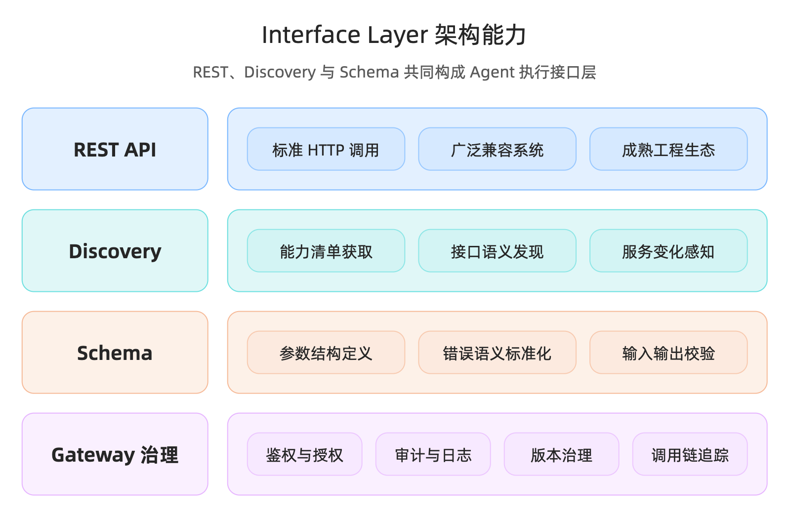
_图：生产级 Interface 层应具备的工程化要点。_

这些要求看似基础，却决定了 Agent 系统能否跨团队复用、跨周期稳定。它们可以进一步理解为五条底线：

第一，元数据统一注册，决定了能力能否被持续发现，而不是靠人工口传。第二，schema 可校验，决定了 Agent 是在“按契约执行”还是“按猜测执行”。第三，身份与授权打通，决定了系统能否在不失控的前提下自动执行。第四，调用链可追踪，决定了问题发生后能否解释和归责。第五，变更可观测，决定了接口演进是否会悄悄破坏线上任务。

很多团队在早期往往只关注“接口通没通”，但真正进入生产后，影响系统稳定性的常常是这些更底层的工程属性。Interface 层如果没有这些底线能力，就会在规模扩大后逐步演变成新的集成脆弱点。

### 7.6 章节小结

Interface 层不是“技术接线层”，而是 Agent 架构的稳定性起点。CLI 适合人，结构化 API 才适合 Agent；单有 REST 不够，还需要 Discovery 与 Schema；协议便利不等于治理完备，必须把权限、审计和版本控制内建进调用路径。只有这样，企业才能在不牺牲可控性的前提下扩大 Agent 执行范围。

如果把第5章的四条原则投射到第7章，可以看到 Interface 层正是 `API-first` 和 `Schema-first` 最先落地的地方：它决定系统有没有稳定接入面，也决定机器能不能按统一契约理解这些接入面。Interface 层做不好，后面的 Capability 编排和 Runtime 执行都会建立在脆弱基础之上。

第8章将继续沿着这条逻辑往下走：当系统已经“连得上”之后，下一步要解决的问题就是“如何把这些可接入接口组织成 Agent 可稳定编排的业务能力”。

<a id="chapter-08"></a>
## 第8章 Capability 层：企业能力的稳定编排

如果说 Interface 层解决的是“能不能连上”，那么 Capability 层解决的就是“连上之后能不能正确完成任务”。在企业实践中，很多 Agent 项目在接口联通后仍然难以规模化，原因通常不是模型不够聪明，而是系统缺少统一的能力抽象。Agent 看到了大量 API，却看不到可执行的业务能力边界。

Capability 层的目标，是把“离散接口”重构为“可规划能力”。它既不是简单 API 网关，也不是业务流程引擎的替代，而是位于两者之间的编排中枢：向上提供稳定语义，向下适配异构系统，横向承接策略与治理。

换句话说，Capability 层真正要解决的问题，不是“再做一层封装”，而是把企业已有系统转化为 Agent 可消费、可组合、可治理的业务执行网络。没有这一层，Agent 只能在海量接口和隐性规则中自行摸索；有了这一层，Agent 面对的就是带业务语义、约束条件和治理信息的能力节点集合。

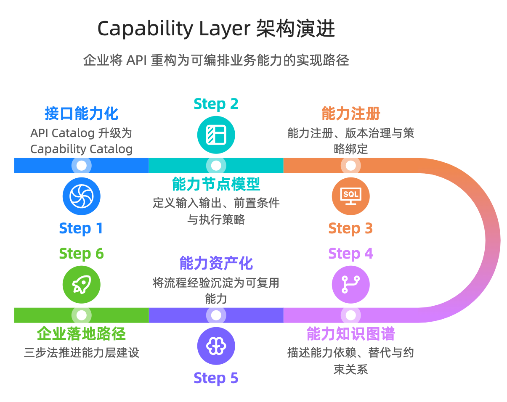
_图：Capability 层在 Agent 与底层异构系统之间承担的编排中枢角色。_

### 8.1 从 API Catalog 到 Capability Catalog

API Catalog 记录的是接口清单，回答的是“有哪些端点可以调用”。Capability Catalog 记录的是能力单元，回答的是“哪些业务目标可以被完成”。这两个问题看似接近，工程结果却完全不同。

在 API 视角下，Agent 需要自行推断调用顺序、前置条件和失败补偿；在 Capability 视角下，这些关键约束被前置到能力定义中，Agent 只需要在约束内规划最优路径。对企业来说，后者更容易形成可复用资产，也更利于跨团队协同。

一个直接经验是：当接口数超过一定规模后，新增流程的边际复杂度会快速上升；而当能力节点形成稳定目录后，新增流程往往变成“能力组合问题”，复杂度增速会显著放缓。

### 8.2 能力节点的基本结构

一个可被 Agent 稳定调用的能力节点，至少应包含以下结构化要素：

1. 目标语义：这个能力要完成什么业务结果。  
2. 输入输出契约：字段、类型、约束、可选项和默认值。  
3. 前置条件：依赖的数据状态、权限条件、业务规则。  
4. 执行策略：同步/异步、超时、幂等、重试与补偿。  
5. 失败语义：可恢复错误与不可恢复错误的边界。  
6. 治理信息：审计字段、责任主体、风险等级和策略标签。

这类定义的价值在于，它让能力不再依赖“资深开发者脑内知识”。Agent 可以基于结构化约束做规划，平台可以基于统一元数据做监控和治理，组织可以基于能力清单做资产化运营。

### 8.3 Capability Registry: 从“文档中心”到“控制平面”

很多团队把能力注册中心理解为“能力文档仓库”，这会低估其作用。生产级 Capability Registry 更像控制平面，至少承担四类职责：

1. 生命周期管理：发布、灰度、下线、兼容策略。  
2. 版本治理：语义版本、破坏性变更检测、依赖影响分析。  
3. 策略绑定：把权限、风控、审计规则绑定到能力层。  
4. 发现与路由：为 Agent 提供可检索、可筛选、可路由的能力视图。

当 Registry 成为控制平面后，企业就可以把“能力变更风险”从项目级问题上升为平台级治理，显著降低跨团队协作摩擦。

Capability Registry 的关键价值，在于让能力不再只是“被记录”，而是“被管理”。一个能力如果只有说明文档，没有生命周期、策略绑定和依赖影响分析，那么它本质上仍然是项目资产，而不是平台资产。Registry 把这些原本散落在各团队流程里的治理动作，收敛到统一控制面上。

从平台视角看，Registry 还是能力运营的起点。企业可以通过它回答很多过去难以统一回答的问题：哪些能力调用最频繁，哪些能力失败率最高，哪些能力即将下线但仍被多个 Agent 依赖，哪些变更会影响高风险业务链路。只有这些问题可以被持续看见，能力体系才真正可运营。

### 8.4 Capability Graph: 复杂任务的组合与解释

单个能力节点只能完成局部动作，复杂业务任务依赖能力组合。Capability Graph 的核心作用，是显式表示能力之间的依赖、顺序、替代与约束关系，让 Agent 在图上完成规划，而不是在接口海洋中盲目试探。

在图结构中，至少要表达三类关系：依赖关系（必须先执行）、替代关系（可切换实现）、约束关系（满足条件才能走该路径）。有了这些关系，Agent 才能在失败场景中执行可解释的路径切换，例如主能力超时后转备用能力，或在高风险动作前自动触发人工确认。

Capability Graph 还有一个组织价值：它把“流程经验”沉淀为可计算资产。原本依赖个人经验的跨系统协作知识，可以被持续复用和优化。

Capability Graph 之所以重要，是因为复杂业务任务往往不是“串几个 API”那么简单，而是存在条件分支、失败切换、人工确认和替代路径。图结构能把这些动态规划所需的知识显式化，让 Agent 的决策不再完全依赖临场推断，而是建立在组织沉淀下来的关系网络之上。

这会直接提升两个关键属性。第一是可解释性，团队可以明确看到 Agent 为什么选择某条路径；第二是可维护性，当业务规则变化时，只需要更新图中的节点关系与约束，而不是让每个 Agent 重新从文档和经验中学习一遍。

### 8.5 Capability 层的建设路径

企业推进 Capability 层时，不建议先做“大而全建模”，而应从高价值链路开始，例如异常告警处置、设备缺陷闭环、检修协同等跨系统流程。每条链路优先抽取 10-20 个高复用能力节点，建立统一 schema 与治理策略，再逐步扩展。

实践中可采用“三步法”：

1. 抽象核心能力：从现有 API 和流程中提炼能力节点。  
2. 建立注册与版本机制：确保能力可发现、可治理。  
3. 引入图式编排：把链路经验沉淀为可规划关系。

这样做可以在三到六个月内看到明显收益：重复对接减少、调用成功率提升、跨团队交付周期缩短。

之所以强调这条路径，是因为 Capability 层建设最容易犯的两个错误：一是抽象过早，试图一次性定义全企业能力地图，结果耗时巨大且迟迟不能落地；二是抽象过浅，只是把现有 API 换个名字挂到目录里，最终没有真正提升编排质量。现实做法应当是在高价值链路上用最小可用能力集先跑通，再逐步向平台化扩展。

实践中，团队最好同时选择一条“业务价值高”的链路和一条“治理要求高”的链路做样板。前者有利于证明能力复用和自动化价值，后者有利于倒逼权限、审计、风险分级等能力尽早进入设计主线。这样形成的 Capability 层，才不会沦为只适合 Demo 的轻量封装。

### 8.6 章节小结

Capability 层是企业 Agent 架构的编排中枢。它把“接口可调用”升级为“业务可完成”，把“项目经验”升级为“平台资产”。没有 Capability 层，Agent 很难跨越 PoC；有了 Capability 层，企业才有机会把自动化从局部试点推进到系统级规模化。

如果把第6章的五层架构进一步细化，Capability 层正是把 Interface 层暴露出来的接口，转化为 Runtime 真正可以规划和执行的业务对象。它站在“接入层”和“执行层”之间，一头连接系统，一头连接任务，是整个 Agent-Native 架构最关键的抽象层之一。

第9章将继续回答 Capability 层之后的另一个核心问题：即使能力已经被很好地抽象出来，Agent 又凭什么在真实企业语境中持续做出正确判断。答案就落在 Data 与 Memory 层。

<a id="chapter-09"></a>
## 第9章 Data 与 Memory 层：企业上下文基础

企业场景中，Agent 的失败往往不是“不会推理”，而是“上下文不完整或不可靠”。同一个任务，在缺少历史状态、业务规则或实时数据时，模型可能给出看似合理但不可执行的答案。Data 与 Memory 层的目标，就是为 Agent 提供可用、可信、可追踪的上下文基础。

这一层不是单纯“加一个向量库”，而是要回答三个工程问题：从哪里取数据、如何保证语义一致、如何让上下文跨任务延续。

Data 与 Memory 层最常见的误判，是把“检索能力增强”当成“上下文问题已经解决”。实际上，企业 Agent 所需的上下文远比文档召回复杂得多：它既要知道实时业务状态，也要理解制度和规则，还要记住任务历史与执行经验。缺少其中任意一部分，Agent 都可能给出看似合理但无法落地的结果。

### 9.1 三层数据语义

面向 Agent 的企业上下文可以分为三类：

1. Structured Data：交易与主数据，强调一致性和准确性。  
2. Knowledge：制度文档、SOP、知识手册，强调可检索与可解释。  
3. Memory：任务历史与行为经验，强调连续性和个性化。

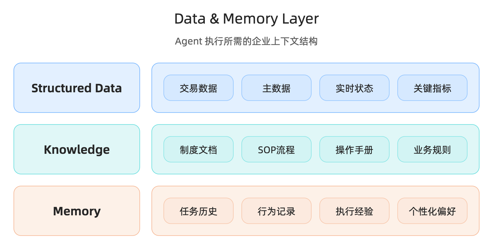
_图：Structured Data、Knowledge、Memory 三类上下文的分工关系。_

这三类数据不能相互替代。仅有结构化数据，Agent 可能不理解政策语义；仅有知识文档，Agent 可能无法执行真实交易动作；仅有会话记忆，Agent 可能无法保证结果正确性。企业需要的是三者协同，而不是单点堆叠。

从架构角度看，这三层分别对应三种不同的可靠性来源：Structured Data 提供事实基础，Knowledge 提供规则与解释，Memory 提供连续性与经验积累。把它们混成一种“统一知识库”虽然实现上看似简单，但会让系统失去对准确性、时效性和语义层次的控制。

### 9.2 检索链路：从召回到可执行上下文

在企业执行场景中，检索不应停留在“返回相关文本”，而应输出“可执行上下文包”。一个实用链路通常包含四步：

1. 语义召回：定位相关知识与历史记录。  
2. 结构化查询：补齐实时状态与关键指标。  
3. 约束注入：加入权限、规则和风险边界。  
4. 上下文压缩：把可执行信息注入到任务计划。

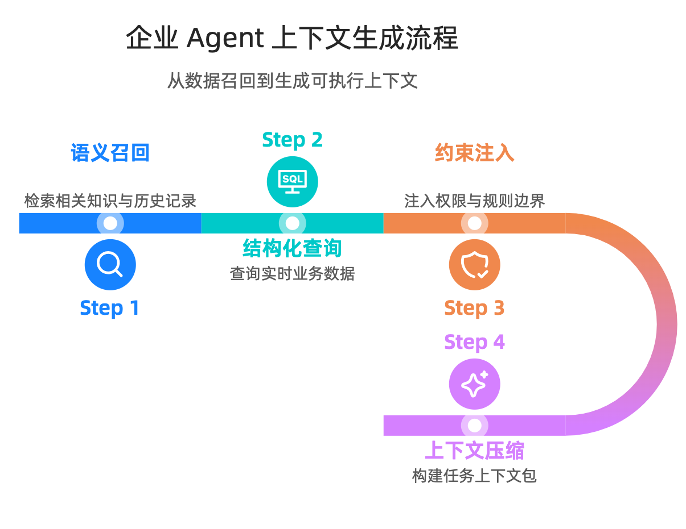
_图：企业检索链路如何从“召回内容”升级为“生成可执行上下文包”。_

这类链路的关键是“先约束后生成”。如果把生成放在约束前，Agent 容易产出高流畅但低可执行的结果；把约束前置后，结果质量会更稳定，也更易审计。

检索链路设计的真正难点，不是如何召回更多内容，而是如何召回“对当前任务真正有用且可执行”的内容。在企业环境里，相关性不等于可执行性。一个高度相关但已经过期的制度片段，可能比完全没有检索结果更危险；一个缺少实时状态补充的知识摘要，也很难直接用于后续动作。

### 9.3 企业记忆的三种形态

企业级 Memory 至少应区分三种形态：

1. 事件记忆（Episodic）：记录任务发生了什么。  
2. 语义记忆（Semantic）：沉淀领域知识与概念关系。  
3. 程序记忆（Procedural）：积累“如何做更好”的策略经验。

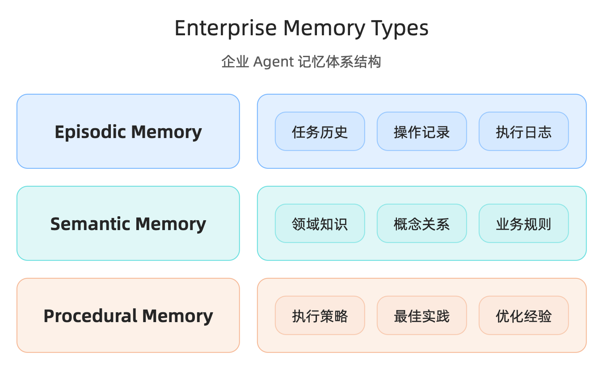
_图：企业记忆体系中事件记忆、语义记忆和程序记忆的区别。_

事件记忆用于追溯与复盘，语义记忆用于理解与解释，程序记忆用于持续优化执行策略。三者协同后，Agent 才能从“每次从零开始”走向“基于经验稳定进化”。

这也是为什么企业级 Memory 不能等同于聊天历史。聊天历史只能记录“说过什么”，却未必能表达“发生过什么”“学到了什么”和“下次该如何更稳地执行”。真正有价值的企业记忆，应当能支持复盘、纠偏、个性化服务和策略优化，而不是单纯延长上下文窗口。

### 9.4 数据新鲜度与一致性

在高价值业务中，过期上下文比缺少上下文更危险。Agent 如果基于旧遥测、旧运行方式或旧调度规程做决策，可能直接触发业务风险。因此 Data 层必须明确新鲜度策略：哪些字段必须实时、哪些可以近实时、哪些可以缓存。

此外，还要明确一致性边界。并非所有场景都需要强一致，但必须知道哪些动作不能在最终一致语义下执行，例如资金扣减、额度审批、合同生效等关键操作。

数据新鲜度之所以是底线问题，是因为 Agent 具有“基于上下文直接采取动作”的能力。一旦上下文过期，错误就不再只是分析误差，而可能变成真正的业务后果。例如负荷转移基于旧潮流数据执行、停役审批基于旧方式安排放行、检修处置基于旧规程触发，这些都不是单纯回答不准，而是可能造成实际损失。

因此，企业需要把新鲜度和一致性从“数据平台内部指标”提升为“Agent 执行前置约束”。系统必须明确哪些字段允许缓存多久，哪些场景必须回源查询，哪些动作前必须进行二次校验。只有这样，Agent 的执行才不是建立在模糊的数据假设上。

### 9.5 记忆治理：遗忘、纠偏与合规

Memory 带来连续性，也带来风险。错误记忆、过期记忆和越权记忆都会导致系统偏差。企业需要建立记忆治理机制，包括记忆有效期、冲突检测、人工纠偏和合规清理策略。

尤其在涉及个人数据或敏感业务信息的场景，记忆系统必须支持最小化存储、可追踪访问和按策略删除。否则，记忆越丰富，合规压力越高。

记忆治理的本质，是防止系统把“历史上曾经有效的信息”错误地当成“当前仍然正确的信息”。企业环境变化快，设备状态会变、运行方式会变、审批策略会变，如果旧记忆长期不被纠偏，Agent 就会把历史经验误当成当前事实。

这意味着 Memory 不是“存得越多越好”，而是“保留对执行真正有价值且可被治理的部分”。一个成熟的企业记忆系统，应当知道哪些记忆该保留用于优化，哪些记忆该降权，哪些记忆必须被删除，哪些冲突必须进入人工纠偏流程。

### 9.6 Data & Memory 层建设顺序

推荐的建设顺序是“先可靠、后智能”：先打通结构化数据访问和权限控制，再建设知识检索，再引入长期记忆与策略学习。若顺序反过来，系统容易出现“知识很全但执行不准”的反差。

企业可以先选一条跨部门链路，建立最小可用的数据上下文闭环，再逐步扩展到全局知识与组织记忆体系。

这个顺序之所以重要，是因为上下文能力具有明显的依赖关系。没有可靠的结构化数据访问，知识检索再强也无法保证动作正确；没有知识与规则补充，结构化数据又难以支撑复杂业务判断；没有稳定的前两层基础，长期记忆只会把错误和噪声不断积累下来。

从实施角度看，最好的做法通常不是先建一个全局知识平台，而是选择一条真实链路，把“实时数据 + 规则知识 + 最小记忆”打成闭环。只有在这条链路上验证过上下文如何被检索、约束、压缩和复用，后续全局扩展才不会变成脱离业务的基础设施工程。

### 9.7 章节小结

Data 与 Memory 层决定 Agent 能否在真实企业语境中持续正确。它不是模型附属模块，而是执行质量的基础设施。只有当结构化数据、知识体系和记忆系统形成统一上下文底座，Agent 才能真正具备跨任务、跨周期、跨部门的稳定执行能力。

如果说第8章回答的是“Agent 能否拿到可执行能力”，那么第9章回答的就是“Agent 凭什么在真实业务环境中做出正确判断”。前者解决执行对象，后者解决判断依据。两者缺一不可。

第10章将继续沿着这条链路往下走：当 Agent 既有能力可调、又有上下文可用之后，剩下的关键问题就是如何把这些能力和上下文组织成稳定可交付的任务执行过程，这正是 Runtime 层要解决的问题。

<a id="chapter-10"></a>
## 第10章 Runtime 层：从生成到交付

在企业环境里，真正难的不是“生成一个答案”，而是“交付一个结果”。结果意味着可执行、可追踪、可恢复、可负责。Runtime 层承担的正是这部分工程责任：把模型能力转化为稳定任务执行。

前面几章已经回答了三个问题：接口如何统一接入、能力如何被抽象、上下文如何持续正确。第10章讨论的是第四个问题：当这些前提都具备后，系统怎样把一次次模型推理、能力调用和异常分支组织成真正可交付的任务执行过程。换句话说，Runtime 层是让 Agent 从“能理解、能调用”跨到“能稳定完成结果”的最后一段工程桥梁。

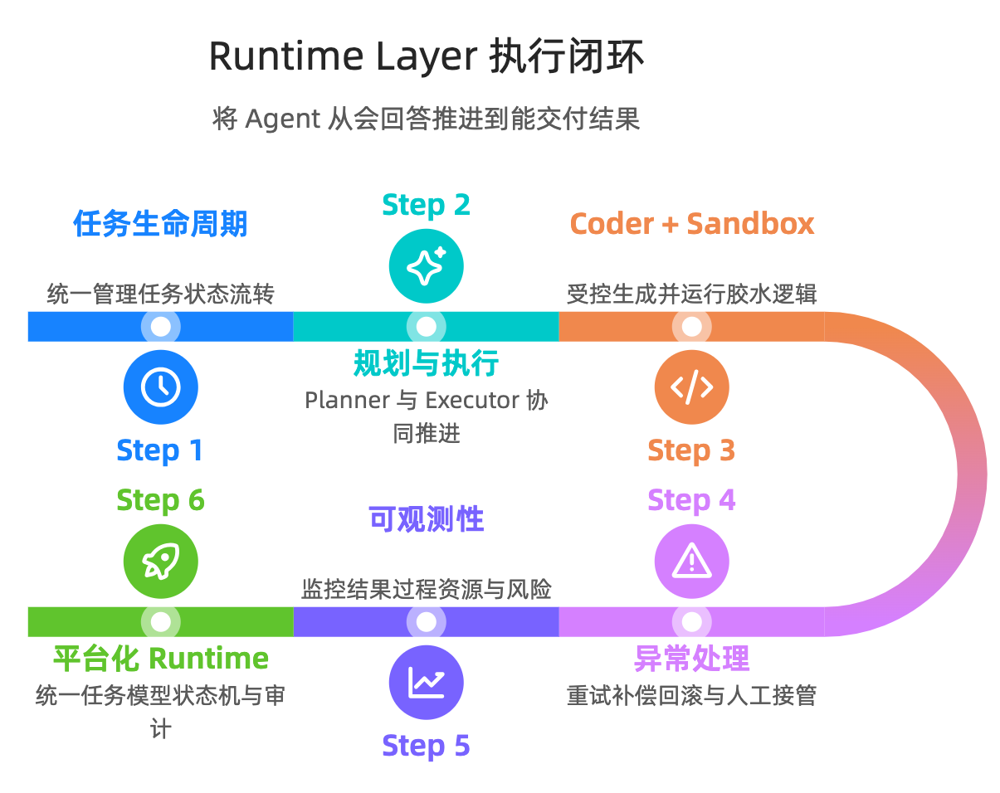
_图：Runtime 层如何把模型能力转化为任务级执行系统。_

### 10.1 Runtime 的核心角色

Runtime 不是调用模型的 SDK 封装，而是任务生命周期控制系统。一个完整任务通常经历目标解析、计划生成、能力调用、状态检查、异常处理、结果回写和审计归档等阶段。

没有 Runtime，Agent 只能做短链路交互；有了 Runtime，Agent 才能处理长链路任务并在失败后恢复。对于企业而言，这一差异决定 Agent 是“助手插件”还是“执行平台”。

### 10.2 Planner-Executor-Coder-Sandbox 闭环

企业常见的执行闭环可以抽象为四个角色：

1. Planner：把业务目标分解为可执行步骤。  
2. Executor：按步骤调用能力并跟踪状态。  
3. Coder：在需要时生成或调整胶水逻辑。  
4. Sandbox：在受控环境中运行高风险或不确定动作。

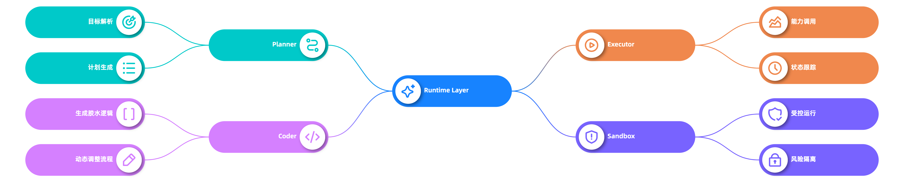
_图：Planner、Executor、Coder、Sandbox 的闭环协同关系。_

这四者必须在同一控制平面下协同，才能形成可管可控的执行闭环。尤其是 Coder 与 Sandbox 的配合，可以在保持灵活性的同时降低执行风险。

### 10.3 异常处理：重试、补偿、回滚与人工接管

企业级任务不可能“永不失败”，关键在于失败如何被处理。Runtime 需要把异常分为可自动恢复与必须人工介入两类，并明确对应动作：重试、降级、补偿、回滚或转人工。

成熟做法是把人工接管设计为系统内建状态，而不是临时兜底。这样既能保证高风险动作可控，也能把人工处理结果反哺给系统，持续提升后续自动化成功率。

异常处理之所以是 Runtime 的核心职责，是因为 Agent 执行链路天然比传统事务处理更长、更不确定。它不仅可能遇到网络超时、接口失败、权限不足，还可能遇到上下文冲突、策略拦截、模型规划偏差等问题。如果系统没有统一的异常分类和恢复机制，任务就会在复杂场景中快速失控。

因此，企业不能只问“失败了怎么办”，还要问“哪些失败可以自动恢复，哪些失败必须中止，哪些失败必须升级人工”。一套成熟 Runtime 的价值，不在于避免所有异常，而在于让异常成为可管理的状态，而不是不可解释的中断。

### 10.4 可观测性：执行数据化

Runtime 的可观测性至少要覆盖四类指标：

1. 结果指标：任务成功率、完成时长、业务产出。  
2. 过程指标：步骤耗时、调用路径、异常分布。  
3. 资源指标：Token、算力、外部接口成本。  
4. 风险指标：越权尝试、策略拦截、人工接管频率。

有了这些指标，企业才能进行工程优化和运营优化。例如识别高失败能力节点、定位高成本任务模式、评估不同策略规则的真实业务影响。

Runtime 可观测性和传统应用监控最大的区别，在于它不只关注“系统活着没有”，还要关注“任务为什么这样执行、结果为什么这样产生”。一个 Agent 任务即使最终成功，也可能成本过高、路径不合理、频繁触发人工接管，这些问题如果不可见，系统就很难持续优化。

从这个角度看，可观测性实际上是 Runtime 的学习回路。它把一次次执行结果沉淀为平台可分析数据，让团队能持续回答三个问题：哪里最不稳定，哪里最贵，哪里最该改。没有这层反馈，Runtime 很容易停留在“能跑”而不是“越跑越好”的状态。

### 10.5 成本与性能：Runtime 的新 SLO

传统系统主要关注吞吐、延迟、可用性；Agent Runtime 还要增加“决策质量成本比”。同一任务可以有多种执行路径，系统需要在成功率、时延与成本之间做动态权衡。

因此，企业需要为 Agent 任务定义新的 SLO，例如“高价值任务优先成功率”“低价值任务优先成本上限”“实时任务优先时延控制”。Runtime 应基于任务等级自动选择执行策略，而不是所有任务走同一模板。

这意味着度量体系需要从“单一技术指标”转向“任务级综合目标”。过去系统可以用统一延迟或可用性目标衡量；现在不同任务的优先级和容错空间差异很大。一个高价值任务宁可慢一点，也要保证正确和可审计；一个低价值任务则可以接受质量略降，但必须把成本压住。

因此，Runtime 的性能管理本质上是一种策略调度能力：为不同任务选择不同模型、不同工具路径、不同重试策略和不同人工介入阈值。真正成熟的 Runtime，不会把所有任务当成一种工作负载，而是会根据任务价值、时效性和风险等级动态分配执行资源。

### 10.6 Runtime 的平台化路径

企业不应把 Runtime 仅当作单项目能力，而应尽快走向平台化。平台化的关键动作包括统一任务模型、统一状态机、统一审计格式、统一策略引擎和统一监控面板。

当 Runtime 平台化后，新业务接入的成本将显著下降，组织可以从“每个团队重复造轮子”转向“复用同一执行底座”。这也是 Agent 能否形成组织级生产力杠杆的关键。

平台化的关键，不只是把几套组件拼成一个公共服务，而是把任务执行中反复出现的共性能力标准化：任务状态如何定义、失败如何分类、人工接管如何进入流程、审计格式如何统一、策略如何下发、指标如何观测。只有这些共性被平台吸收，业务团队才能真正专注于能力和场景，而不是反复重造执行框架。

从组织视角看，Runtime 平台化还意味着 Agent 建设从“项目交付”迈向“平台运营”。此时团队关注的不再只是某个场景是否跑通，而是平台复用率、接入周期、任务成功率、人工接管率和单位任务成本。这正是企业级 Agent 能否形成长期生产力红利的分水岭。

### 10.7 章节小结

Runtime 层决定 Agent 系统是否具备企业级交付能力。它把智能从“生成内容”推进到“完成任务”，把不确定执行纳入可治理框架。对企业而言，Runtime 不是可选组件，而是 Agent 进入核心业务的基础门槛。

如果说第9章回答的是“Agent 是否拥有可靠上下文”，那么第10章回答的就是“这些上下文与能力如何被组织成可交付过程”。前者解决判断依据，后者解决交付机制。两者结合，Agent 才能从“看起来懂业务”真正走向“稳定完成业务”。

第11章将进一步讨论 Runtime 之后的最后一道门槛：即使系统已经能稳定执行，企业为什么仍然不能直接放权上线。原因在于，自动化能力越强，治理要求越高，这正是安全与治理层要解决的问题。

<a id="chapter-11"></a>
## 第11章 安全与治理：Agent 能上线的前提不是“更聪明”，而是“更可控”

在企业环境中，任何自动化能力都会同时放大价值与风险。Agent 执行能力越强，潜在收益越高，但风险也越集中。如果没有安全与治理底座，Agent 很容易停留在“建议模式”，无法进入核心业务闭环。第11章讨论的重点不是“如何绝对避免风险”，而是“如何把风险纳入可度量、可拦截、可追责的系统过程”。

这也是为什么治理不能被当作项目上线前的最后一道审批环节。对传统软件来说，安全很多时候还是外围控制；对 Agent 来说，治理必须嵌入执行路径本身，因为系统已经不只是“展示信息”，而是在代表组织做判断、调能力、改状态。第11章关注的，正是这种执行型系统应当具备的治理底座。

### 11.1 Agent Identity: 执行主体识别

传统系统中的身份体系主要围绕“人账号”设计，而 Agent 场景需要引入“机器执行主体身份”。每个 Agent、每个子任务执行器、每次外部能力调用都应有明确身份标识，并与企业 IAM 体系映射。

身份明确后，系统才能回答四个关键问题：谁发起任务、谁执行动作、谁批准高风险步骤、谁对结果负责。没有这层映射，审计记录会停留在“系统调用了系统”，责任无法落地到组织角色。

实践上，企业应把 Agent 身份视作一等主体，建立与员工、服务账号并列的身份域，并支持生命周期管理，包括注册、轮换、停用与应急冻结。

Agent Identity 的本质，是把机器执行体纳入企业责任体系。只要系统中还存在“动作发生了，但不知道是谁代表谁发起的”这种灰区，治理就无法真正落地。身份清晰不仅影响审计，也直接影响授权、策略命中、异常归责和事件处置速度。

### 11.2 细粒度授权：上下文化授权

Agent 的授权不能只做粗粒度角色控制。它需要同时考虑任务意图、数据敏感级别、执行时上下文和风险等级。换句话说，权限不是静态清单，而是上下文相关策略。

例如同一“停役审批”能力，在一般设备检修可按规则自动流转，在重要输变电设备上需要双重确认，在涉及保供时段时则必须转人工。策略应表达“何时、由谁、在何条件下允许执行什么动作”，并可被机器实时判定。

这要求企业从 RBAC 走向更细粒度的策略模型（如属性与策略组合），并将策略执行点嵌入 Runtime 路径，而不是仅放在接口外围。

在 Agent 场景下，授权判断必须从“静态角色匹配”升级为“上下文动态判定”。因为同一个能力，在不同任务、不同金额、不同用户授权和不同风险等级下，允许范围可能完全不同。把授权做成上下文感知的实时决策，才能防止系统在技术上可调用、业务上却越权执行。

### 11.3 策略引擎与风险分级

可运行的治理体系通常需要风险分级模型。一个实用分级方式是把任务分为低风险（可自动执行）、中风险（条件执行+抽检）、高风险（强制人工确认）。

策略引擎负责在任务每个关键节点进行决策：允许、拒绝、降级、转人工。更重要的是，策略结果应可解释，即每次拦截都能说明原因。可解释策略不仅提升审计效率，也能帮助业务团队修正规则，避免“黑盒治理”。

当风险分级与能力节点绑定后，治理才不会沦为事后补救，而会成为执行路径中的内建约束。

风险分级的关键，不在于把所有场景分得多细，而在于形成可运行、可复核、可调整的治理闭环。策略引擎应当既能拦截高风险动作，也能解释为什么拦截；既能支持规则持续迭代，也能让业务、风险、技术三方围绕同一套风险语言协同。

### 11.4 审计与留痕：从日志到决策还原

企业对 Agent 的审计需求，不止是记录接口调用，还要能还原决策过程。一次关键任务的审计链通常应包含：任务目标、计划版本、上下文来源、策略判定、能力调用顺序、异常处理路径、最终结果及责任主体。

这要求审计数据结构标准化，并能够跨系统拼接成完整链路。若审计分散在各服务日志中，出问题时很难在可接受时间内完成复盘。

此外，审计不仅服务于合规，也服务于工程优化。通过审计链路，企业可以定位高风险高失败路径，持续改进能力定义和策略配置。

这也是 Agent 审计与传统应用日志的本质区别。传统日志更偏向“系统发生了什么”，而 Agent 审计需要回答“系统为什么这么做”。只有决策依据、执行顺序、策略命中和异常分支都能被还原，治理才不只是形式上的留痕，而是真正可复盘、可问责、可改进。

### 11.5 数据安全与隐私治理：最小化、分级、可撤销

Agent 往往横跨多个业务域，天然带来更大数据触达范围。要控制这类风险，核心原则是三点：最小必要访问、数据分级治理、可撤销与可清理。

最小必要访问要求 Agent 只获取完成当前任务所需字段；数据分级要求不同敏感级别的数据采用不同脱敏与审批策略；可撤销与可清理要求系统支持按策略删除记忆与上下文副本，避免“长期滞留”带来的合规风险。

在实践中，企业还应建立敏感操作白名单与高风险操作双人复核机制，避免单点自动化动作造成不可逆损失。

数据治理之所以在 Agent 时代更敏感，是因为 Agent 的优势恰恰来自跨域整合上下文，而跨域整合本身就意味着更大的数据触达半径。企业如果不能明确哪些数据可以给、给到什么粒度、保留多久、何时清除，就会在提升智能的同时扩大合规暴露面。

### 11.6 模型与供应链治理

企业 Agent 往往依赖外部模型、第三方工具和开源组件。安全治理必须覆盖这条供应链，包括模型版本管理、第三方能力准入、依赖变更评估和应急切换预案。

一个常见误区是“模型升级只影响效果”。事实上，模型行为变化可能直接影响执行路径和策略命中率。因此，每次模型或关键依赖升级都应经过灰度验证，并具备快速回滚能力。

模型与供应链治理的核心，在于承认外部依赖本身就是系统边界的一部分。企业不应把模型、第三方工具和开源依赖看成纯技术组件，而应把它们纳入版本治理、风险评估和应急预案。否则，一次外部变化就可能同时影响结果质量、执行路径和安全策略命中率。

### 11.7 章节小结

安全与治理不是 Agent 项目的阻力，而是其进入生产核心的通行证。只有身份可识别、权限可判定、策略可执行、审计可还原、数据可管控，Agent 才能从“可演示”升级为“可运营”。

如果说第10章回答的是“系统能不能稳定执行”，那么第11章回答的就是“系统即使能稳定执行，凭什么被组织信任并放权上线”。前者解决执行能力，后者解决组织信任。没有这层治理，系统越强，风险反而越难接受。

第12章将在此基础上回到一个更现实的问题：企业不可能一次性完成全部升级，那么应当按照什么节奏推进，才能既看到业务价值，又不把治理和底座建设拖到最后。

<a id="chapter-12"></a>
## 第12章 企业落地路线图：从局部试点到组织级平台

前面章节回答了“为什么要做、应该怎么设计”，第12章回答“如何落地”。企业最需要的不是理想化终局图，而是一条可执行、可评估、可扩展的阶段性路线。以下路线图适用于大多数中大型组织，可根据行业监管强度与系统基础做节奏调整。

路线图的意义，不是把所有企业都塞进同一张甘特图，而是给出一条“从局部试点到组织级能力”的合理爬坡路径。很多 Agent 项目失败，不是因为方向错误，而是因为推进节奏失衡：要么过早追求全局平台化，迟迟看不到业务结果；要么只做局部场景堆叠，最终无法形成统一底座。第12章的目标，就是在价值兑现与底座建设之间找到现实平衡。

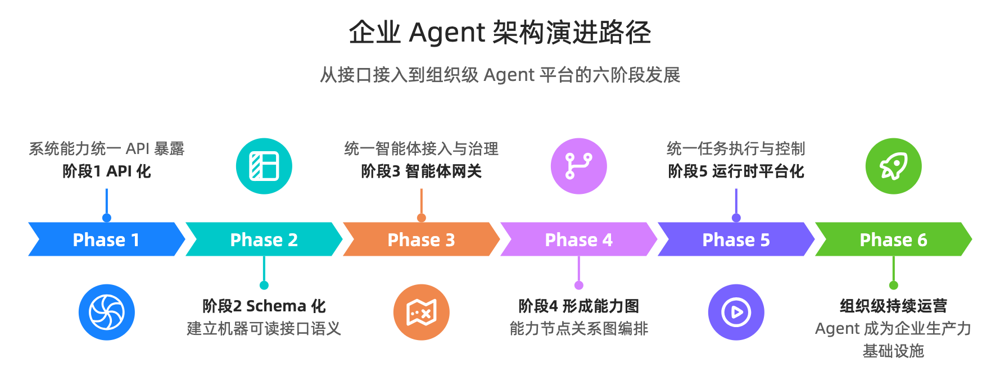
_图：企业从接口化到 Runtime 平台化的阶段性演进路线。_

### 12.1 阶段一：能力接口化（0-3个月）

目标是把高价值业务动作从页面和人工流程中解耦出来，形成可调用接口。重点不是覆盖率，而是质量：优先改造高频、高复用、跨系统的关键动作。

阶段产出应包括：核心能力清单、统一接口规范、基础鉴权方案、最小审计链路。评估指标建议关注接口可用率、调用成功率和接入周期。

这个阶段的关键，不是“接口数量越多越好”，而是先把最影响业务链路的关键动作从页面、脚本和人工流程里解耦出来。企业需要优先挑那些既高频又可复用、且一旦接口化就能在多个场景里复用的动作，以最快建立第一批可执行资产。

### 12.2 阶段二：语义结构化（2-6个月）

在已有接口基础上推进 schema 标准化，建立输入输出契约、错误语义与版本规则。该阶段的关键是减少“隐式约定”，让机器能够稳定理解和校验。

阶段产出应包括：统一 schema 注册机制、兼容性策略、自动化校验流水线。评估指标建议关注调用错误率下降、联调时间缩短和变更事故率。

这一阶段本质上是在把“能调”升级为“能稳定调”。如果没有统一 schema，企业会发现每新增一个 Agent 都要重新解释一遍字段含义和状态语义，集成成本无法下降。语义结构化的价值就在于把这些隐性知识前置为平台契约。

### 12.3 阶段三：Agent Gateway 与统一治理（4-9个月）

当接口和 schema 达到基础稳定后，可引入 Agent Gateway 统一承接发现、路由、鉴权、限流与审计。这一步标志着 Agent 接入从项目制走向平台制。

阶段产出应包括：统一接入入口、策略执行点、调用链追踪面板。评估指标建议关注新 Agent 上线周期、跨团队复用率和异常恢复时长。

这一步标志着建设重点从“做出几个能跑的场景”转向“形成可复制的接入机制”。只有当发现、路由、鉴权、审计和限流被统一承接，Agent 接入才会从一次次项目交付，转向具备平台特征的重复复用。

### 12.4 阶段四：Capability Graph 与跨域编排（6-12个月）

该阶段重点是从“单能力调用”升级到“多能力编排”。通过 Capability Graph 显式建模依赖与替代关系，支持复杂任务自动规划和失败路径切换。

阶段产出应包括：核心业务域能力图、编排策略模板、补偿与回滚机制。评估指标建议关注端到端任务成功率、人工接管比例和业务周期缩短幅度。

这一步通常是从“自动调用能力”迈向“自动完成任务”的真正转折点。企业会开始发现，问题已经不再是接口接不接得上，而是跨域能力之间的依赖、替代、约束和异常路径能否被系统显式表达并稳定执行。

### 12.5 阶段五：Runtime 平台化运营（9-18个月）

最后阶段是组织级平台化：统一任务模型、统一状态机、统一策略与审计、统一可观测性。此时 Agent 能力不再附着于单个项目，而成为企业公共执行底座。

阶段产出应包括：企业级 Runtime 平台、能力运营机制、治理委员会和持续优化流程。评估指标建议关注平台复用率、单位任务成本和跨业务复制速度。

到了这个阶段，Agent 建设不再附着于单个业务项目，而是形成企业公共底座。平台团队开始关注的不是“哪个 Demo 最亮眼”，而是“多少业务在复用同一执行底座、多少成本被真正压下来、多少能力能够跨场景复用”。这才是组织级生产力杠杆出现的信号。

### 12.6 路线图中的组织机制

技术路线能否落地，常常取决于组织机制。建议企业建立“架构+业务+风险”三方协同机制：架构团队负责平台底座，业务团队负责能力语义，风险团队负责策略与合规。三方共同维护能力目录与风险分级，避免“技术单边推进”导致落地断层。

此外，建议设立季度级里程碑，采用“可运行样板间”方式推进，即每个阶段至少落地一条端到端业务链路，以结果驱动标准演进。

组织机制之所以重要，是因为 Agent 建设天然跨越技术、业务和风险三条线。如果没有稳定的协同机制，常见结果不是技术做不出来，而是标准没有人拍板、能力语义没有人负责、风险规则没人持续维护。最终平台存在，业务不敢用；或者业务想用，平台又跟不上。

“可运行样板间”是避免这类断层的有效方式。它要求每个阶段都拿一条真实链路来验证标准，而不是只在文档和设计会上讨论。只有标准在真实任务里被验证过，平台能力和治理规则才会真正沉淀成可复用资产。

### 12.7 章节小结

Agent 落地不是一次性工程，而是平台化演进过程。正确路径不是“先做最强智能”，而是“先建稳定底座，再放大智能边界”。当路线图按阶段推进并与组织机制绑定，企业才可能把试点成果转化为长期竞争力。

更重要的是，路线图不只是技术建设顺序，也是组织学习顺序。企业需要先学会如何把动作接口化，再学会如何把语义结构化，接着学会如何把能力和治理平台化，最终才有条件把 Agent 变成组织级执行网络。

第13章将在这一基础上进一步讨论：当这条技术路线真正走通后，企业内部角色分工、软件采购方式和平台竞争格局会发生什么变化。

<a id="chapter-13"></a>
## 第13章 组织与商业模式变化：技术架构如何重塑企业价值链

当企业系统从应用中心转向能力中心，变化不会停留在技术层。研发协作方式、软件采购逻辑、平台竞争格局都会随之改变。第13章关注的是“架构变化的业务后果”。

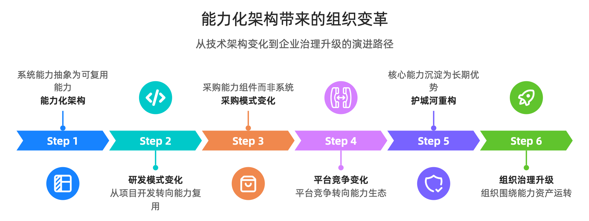
_图：Agent-Native 架构如何反向影响研发分工、采购模式和平台竞争格局。_

### 13.1 研发角色变化：从功能交付到能力运营

在传统模式下，团队按项目交付页面和流程；在 Agent 模式下，团队需要持续运营能力节点。能力一旦被注册和复用，就会变成长期资产，要求团队对其语义稳定性、性能和治理质量持续负责。

这会推动研发角色分化：一部分团队专注能力产品化，一部分团队专注 Runtime 与治理平台，一部分团队专注业务编排与运营优化。组织能力将从“人力堆叠”转向“能力复用率”。

更本质地说，研发工作的对象正在发生迁移。过去工程师更像是在为人类用户开发页面和流程，让人完成系统间的协同；未来工程师会越来越多地把企业中的专项能力抽象、封装并产品化，让 Agent 可以在统一约束下直接调用这些能力完成任务。页面仍然会存在，但它不再是唯一核心交付物；能力接口、能力语义、执行约束和治理规则，会逐步成为新的核心工程产物。

### 13.2 软件采购变化：从系统采购到能力调用

企业采购逻辑也会变化。过去采购重点是“买一个完整系统”；未来更可能是“采购可接入的能力集合”，并按调用量、结果质量或业务增益计费。

这意味着供应商竞争焦点将从界面与功能清单，转向能力质量、接入成本、治理兼容性和生态可组合性。谁能提供标准化、可审计、低耦合的能力接口，谁就更容易进入企业核心链路。

### 13.3 平台型企业的价值上移

随着能力网络扩展，平台型能力会获得更强网络效应：能力越多、调用越多、反馈越多，优化越快。平台价值不再仅来自流量分发，而来自“能力路由与治理控制权”。

对企业自身而言，这意味着需要提前布局内部平台化能力，避免未来在关键执行链路上完全依赖外部平台。

这类价值上移的本质，是控制点从“谁拥有更多功能”逐步转向“谁掌握更关键的能力路由、规则控制和反馈闭环”。当能力调用成为新的生产活动，平台的价值就不再只是连接供需，而是决定哪些能力被优先暴露、如何被治理、如何被持续优化。

### 13.4 护城河重构：能力可组合与数据闭环

传统软件护城河常依赖功能深度和实施复杂度。Agent 时代，护城河更可能来自两点：能力可组合性和高质量数据闭环。可组合性决定系统能否快速适配新需求，数据闭环决定系统能否持续提升执行效果。

因此，企业竞争优势将更多体现在“能力资产化速度”和“运行数据反馈效率”，而不是单次项目交付规模。

这意味着未来的护城河不会只来自“有没有这个功能”，而更多来自“这个能力能否快速组合到新场景中”以及“运行后的反馈能否持续反哺系统优化”。功能本身会越来越容易被复制，而高质量能力网络和长期数据闭环则更难被短期模仿。

### 13.5 组织治理的新要求

技术和商业变化会倒逼组织治理升级。企业需要建立能力所有权机制、跨域版本治理机制和风险责任矩阵，明确“谁定义能力、谁批准策略、谁承担结果责任”。

如果没有这套治理，能力层会很快演变为新的“接口孤岛”，重复历史问题。

组织治理升级的重点，不只是增加几项审批流程，而是建立一套与能力资产化相匹配的责任体系。只有当能力定义权、版本决策权、风险审批权和运行责任都被明确下来，平台化带来的复用效率才不会反过来制造新的协调混乱。

### 13.6 章节小结

Agent 架构带来的不是局部提效，而是价值链重排：研发从项目交付转向能力运营，采购从系统订阅转向能力消费，竞争从功能竞赛转向能力网络竞赛。企业越早完成组织机制适配，越能把技术红利转化为经营红利。

如果说前面章节讨论的是“系统该怎么建”，那么第13章强调的是“系统建成后，企业会因此变成什么样”。技术架构变化最终一定会反向作用于组织结构、采购逻辑、平台边界和竞争方式。谁先意识到这一点，谁就更容易把一次技术升级变成长期经营优势。

<a id="chapter-14"></a>
## 第14章 结语：企业 IT 正从“应用集合”演进为“可编排能力网络”

回到本文开头的问题，Agent-Native 为什么会成为企业软件架构的下一次范式重构。经过前文分析，可以给出一个清晰结论：这不是在现有系统上“加一个智能入口”，而是在重构企业软件的组织方式。

过去，企业系统的核心单位是“应用”；未来，核心单位将是“能力”。过去，自动化依赖预设流程；未来，执行将更多依赖在约束内的动态规划。过去，治理以人操作为中心；未来，治理将覆盖机器执行全链路。

这场演进不会一夜完成，也不需要推倒重来。最现实的路径，是沿着“API-first -> Schema-first -> Capability-based -> Observable”的主线做增量升级：先把关键动作能力化，再把能力纳入统一注册、编排、治理与观测，最终形成组织级 Runtime 平台。

对于企业管理者而言，关键决策不在于“是否要上 Agent”，而在于“是否现在开始建设可持续底座”。因为模型能力会持续进步，而接口、治理和组织能力的建设周期更长，越晚启动，后续补课成本越高。

未来三到五年，领先企业与跟随企业的差距，可能不再主要体现在“是否有 AI 功能”，而体现在“是否拥有可持续进化的能力网络”。当企业具备这种网络，它就不只是拥有一组系统，而是拥有一个可以持续学习、持续执行、持续创造价值的数字化生产体系。

Agent 时代真正改变的，不只是交互方式，而是企业软件的生产组织逻辑。系统不再主要围绕“人在哪里点击”来设计，而是围绕“组织有哪些能力、这些能力如何被执行、这些执行如何被治理”来重新组织。谁能率先把这种逻辑落到工程体系中，谁就更可能在响应速度、运营效率和组织杠杆上形成代差。

因此，本文最终想强调的并不是某个单点技术选型，而是一种演进方向：企业 IT 正在从应用集合，走向能力网络；从信息支撑系统，走向执行支撑系统；从人驱动流程，走向人机协同下的动态执行体系。对多数企业而言，这条路不会一步到位，但它已经开始成为未来几年最重要的架构主线之一。

这就是 Agent 时代企业应用架构的真正方向，也是企业今天就应该开始准备的底层变化。

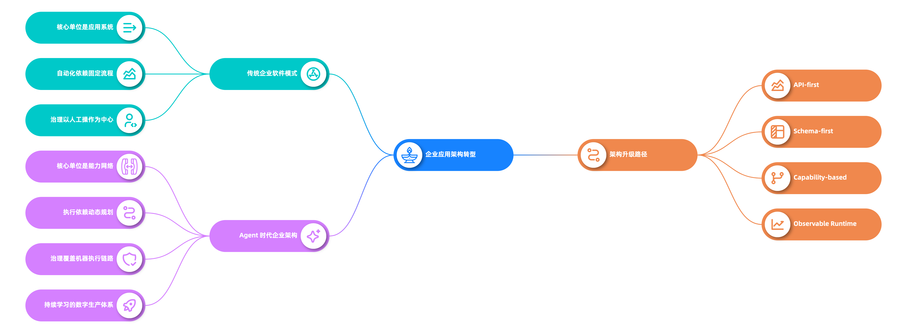
_图：全文结论图，强调企业 IT 向能力网络与执行网络演化。_

<a id="references"></a>
## 参考文献

以下文献主要支撑本文关于 Agent 推理与工具调用、检索增强、上下文协议、风险治理与云原生参考架构的关键论点；其中 Capability Layer、落地路线图与组织治理部分包含基于企业架构实践的综合归纳。

1. Cloud Native Computing Foundation. *Cloud Native Reference Architecture*. https://architecture.cncf.io/
   对应本文关于“云原生不是单一产品，而是面向分布式、可组合、可演进的软件组织方式”的架构背景。

2. Wang, L., Ma, C., Feng, X., et al. *A Survey on Large Language Model based Autonomous Agents*. arXiv:2308.11432, 2023. https://arxiv.org/abs/2308.11432
   对应本文关于 Agent 基本构成、规划-记忆-行动框架，以及 Agent 系统工程化挑战的总体判断。

3. Yao, S., Zhao, J., Yu, D., et al. *ReAct: Synergizing Reasoning and Acting in Language Models*. arXiv:2210.03629, 2022. https://arxiv.org/abs/2210.03629
   对应本文关于 Agent 不只是生成内容，而是通过推理与动作交替完成任务、提升可解释性的论述。

4. Schick, T., Dwivedi-Yu, J., Dessì, R., et al. *Toolformer: Language Models Can Teach Themselves to Use Tools*. arXiv:2302.04761, 2023. https://arxiv.org/abs/2302.04761
   对应本文关于模型通过外部工具扩展能力边界，以及“工具调用是 Agent 能力闭环关键组成”的论述。

5. Lewis, P., Perez, E., Piktus, A., et al. *Retrieval-Augmented Generation for Knowledge-Intensive NLP Tasks*. arXiv:2005.11401, NeurIPS 2020. https://arxiv.org/abs/2005.11401
   对应本文关于 Data & Knowledge Layer、检索增强、外部知识接入与可溯源上下文的重要性。

6. Anthropic. *Model Context Protocol (MCP)*. https://docs.anthropic.com/en/docs/build-with-claude/mcp
   对应本文关于 Protocol 层、工具接入标准化，以及 MCP 作为 Agent 与外部工具/数据源协定层的讨论。

7. Anthropic. *MCP Connector*. https://docs.anthropic.com/en/docs/agents-and-tools/mcp-connector
   对应本文关于 MCP 与企业 API 体系分层协同、协议便利与治理边界分离的工程实践说明。

8. National Institute of Standards and Technology. *Artificial Intelligence Risk Management Framework (AI RMF 1.0)*. NIST AI 100-1, 2023. https://doi.org/10.6028/NIST.AI.100-1
   对应本文关于安全、治理、审计、可解释与组织级风险管理的总体框架。

9. National Institute of Standards and Technology. *Artificial Intelligence Risk Management Framework: Generative Artificial Intelligence Profile*. NIST AI 600-1, 2024. https://doi.org/10.6028/NIST.AI.600-1
   对应本文关于生成式 AI / Agent 上线前需要纳入治理、风险分级与运行约束的具体论点。

10. Every. *Agent-native Architectures: How to Build Apps After the End of Code*. https://every.to/chain-of-thought/agent-native-architectures-how-to-build-apps-after-the-end-of-code
   对应本文关于“应用中心向能力中心迁移”、以 Agent 为执行主体重构软件形态，以及从功能开发走向执行网络构建的讨论。

<a id="appendix-checklist"></a>
## 附录：企业落地评估清单

建议用法：按季度或阶段里程碑更新一次，由架构负责人牵头，业务负责人和风险负责人共同评审；每项建议采用 `0-3` 分制评分，其中 `0=未启动`、`1=局部试点`、`2=已成体系`、`3=规模化运行`。

| 维度 | 核心检查项 | 达标标准（建议） | 评分方式 | 责任角色 | 典型输出 | 当前状态 |
|---|---|---|---|---|---|---|
| Interface | 是否已建立 Discovery + Schema 注册 | 关键能力 80%+ 可发现且有机器可校验 Schema | 检查能力覆盖率、Schema 覆盖率、变更预警能力 | 平台架构负责人 | 接口目录、Schema 注册表、变更公告机制 | 待评估 |
| Capability | 是否形成能力目录与版本机制 | 至少 20 个高复用能力节点纳入统一治理 | 检查能力复用率、版本管理、灰度/下线流程 | 业务架构负责人 | Capability Catalog、版本策略、能力分级清单 | 待评估 |
| Data & Memory | 是否具备上下文新鲜度与权限策略 | 高风险决策链路全部使用实时或近实时数据 | 检查数据新鲜度分级、权限控制、记忆清理机制 | 数据平台负责人 | 数据访问策略、知识索引、记忆治理规则 | 待评估 |
| Runtime | 是否具备统一任务状态机与补偿策略 | 端到端任务成功率、重试率、人工接管率可观测 | 检查任务模型、状态机、补偿/回滚、监控指标 | Agent 平台负责人 | 任务状态机、执行审计日志、运行仪表板 | 待评估 |
| Security & Governance | 是否实现身份、策略、审计闭环 | 高风险动作 100% 可追溯到主体与策略判定 | 检查身份映射、策略命中、审计还原、合规留痕 | 安全与风险负责人 | 身份体系映射、策略规则库、审计报告 | 待评估 |

典型评审输出应至少包含三项：当前分数、阻塞问题、下一阶段改进动作。若某维度连续两个周期低于 `2` 分，应单独立项补齐底座能力。

<a id="appendix-openapi-spec"></a>
### 附录A：规范引用（OpenAPI）

- 规范名称：OpenAPI Specification (OAS) 3.0.3  
  规范地址：https://spec.openapis.org/oas/v3.0.3
- 规范主页：OpenAPI Initiative  
  地址：https://www.openapis.org
- 版本源文件（GitHub）：OpenAPI-Specification / versions/3.0.3.md  
  地址：https://github.com/OAI/OpenAPI-Specification/blob/main/versions/3.0.3.md
