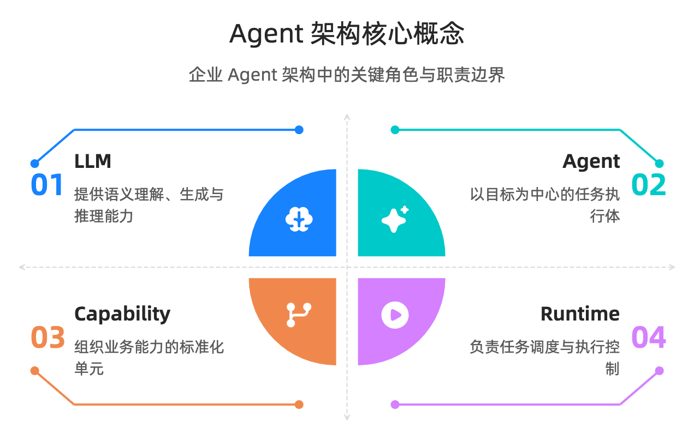

# 基于 Agent 的云原生企业应用架构

## 第1章 引言：企业架构进入 Agent 时代

过去二十年，企业信息化建设的主线是“把业务流程软件化”。从 ERP、CRM 到 OA、BI，系统边界基本围绕“人”展开：人登录系统、人点击页面、人在不同系统间搬运信息。即使进入微服务和云原生阶段，企业架构的核心假设依然是“人是主要执行者，系统是辅助工具”。

这个假设正在被打破。大模型让机器第一次具备了在复杂上下文中理解目标、分解任务、调用能力并持续执行的可能性。企业开始引入 Agent，不再满足于“问答助手”或“页面内 Copilot”，而是希望它能够跨系统完成一条完整业务链路，例如从“发现异常销售波动”到“自动拉取多源数据、生成分析、发起补货建议并推动审批”。这意味着 Agent 不只是新的人机交互入口，而是在企业系统中逐步成为新的执行主体。

当执行主体发生变化，架构中心也会变化。传统架构强调应用系统边界、菜单流程和角色页面；Agent 时代的架构更强调能力暴露、可发现接口、可编排执行和可审计决策。简单说，企业 IT 正从“应用集合”向“能力网络”迁移：系统不再主要以页面组织，而是以可调用能力组织；流程不再完全预编排，而是由 Agent 在约束下动态规划；自动化不再局限于固定脚本，而是进入可持续运行、可反馈学习的阶段。

这一变化并不意味着现有系统会被推倒重来。相反，未来三到五年最现实的路径是“增量演进”：在保留核心交易系统稳定性的前提下，把既有系统中的关键业务动作逐步能力化、接口化、治理化，让 Agent 能够安全、可靠地接入并执行。谁先完成这一步，谁就更可能在组织效率、响应速度和运营成本上形成新的结构性优势。

因此，讨论“未来基于 Agent 的企业应用架构”，本质上不是讨论某个模型是否更强，而是回答三个更基础的问题：企业系统如何被 Agent 理解，企业能力如何被 Agent 调用，企业风险如何在 Agent 执行中被持续控制。后续章节将围绕这三个问题展开。

## 第2章 先把概念讲清楚：避免架构讨论中的认知混用

在企业实践中，很多关于 Agent 的讨论会迅速陷入分歧，常见原因不是技术路线本身，而是关键概念被混用。只有先建立统一术语，后续架构决策才有可比性。

### 2.1 Agent、LLM、Workflow、RPA 的边界

LLM 是“认知与生成能力”，负责理解语义、生成内容、推理方案，但它本身不等于业务系统。Agent 是“以目标为中心的执行体”，通常由模型、工具接口、上下文管理、策略约束和执行循环组成。换句话说，LLM 是 Agent 的核心引擎之一，但 Agent 还包含执行与治理机制。

Workflow 是预定义流程引擎，强调确定性、可追踪、固定节点编排。它适合高稳定、低变化的流程，如固定审批链、批量结算、规则化通知。RPA 是对现有人机操作的自动化复刻，优势是无需改造底层系统即可快速落地，但在跨场景泛化和复杂异常处理上成本较高。

Agent 与 Workflow/RPA 的关键差异，在于它可以在约束条件下进行动态规划。它不是简单替代流程引擎，而是补足“流程之外”的决策与编排能力。更合理的企业形态通常是三者协同：Workflow 负责稳定骨架，RPA 覆盖遗留系统缺口，Agent 处理跨系统、非结构化和高变化任务。

### 2.2 Capability 与 API 的关系

API 是接口形式，Capability 是业务能力单元。一个 Capability 往往由多个 API、规则和状态约束共同构成。例如“创建采购单”并不只是一次 `POST /purchase-orders`，还包含预算校验、供应商资质检查、权限策略和审计记录。

如果企业只做 API 暴露，不做 Capability 建模，Agent 接入后会面临两个问题：第一，接口很多但语义分散，难以正确选择与组合；第二，接口可调但业务边界不清，容易出现“调用成功但业务错误”。因此，面向 Agent 的架构需要从“接口目录”升级到“能力目录”，用统一的输入输出 schema、前置条件、后置约束和失败语义定义能力节点。

### 2.3 Runtime、Memory、Protocol 的职责划分

Runtime 是 Agent 的执行控制平面，负责计划生成、任务调度、工具调用、重试回滚、异常升级和可观测性采集。没有 Runtime，Agent 往往只能停留在“单次问答”；有了 Runtime，Agent 才能以任务生命周期为单位稳定运行。

Memory 是上下文连续性的基础设施，不只是“聊天记录”。在企业场景中，Memory 通常包括短期任务记忆、长期业务记忆和策略性经验记忆。它决定 Agent 能否在多轮、多天甚至跨部门协作中保持一致行为。

Protocol 是 Agent 与外部能力交互的协定层，核心目标是让能力可发现、可验证、可授权、可演进。它关注的不是“接口写没写出来”，而是“不同团队、不同系统、不同 Agent 能否以一致方式互操作”。

### 2.4 为什么概念澄清是架构前置条件

企业在 Agent 转型初期最常见的误区，是把“接一个模型”当成“完成架构升级”。这会导致试点项目短期有演示效果，但无法规模复制：能力不可复用、流程不可审计、风险不可治理。相反，当团队先统一术语，再分层设计，技术路线就会清晰很多。

可以用一句话总结本章：LLM 决定智能上限，Agent 决定执行形态，Capability 决定组织方式，Runtime 决定工程可靠性，Protocol 决定生态可扩展性。企业架构升级必须同时覆盖这五个维度。

## 第3章 传统企业应用架构的结构性瓶颈

在讨论“新架构”之前，需要先识别旧架构的真实约束。多数企业并不是没有系统，而是系统太多、太碎、太难协同。Agent 之所以成为趋势，不是因为概念新，而是因为它正好对准了传统架构长期未解决的结构性问题。

### 3.1 系统烟囱与流程断点

企业通常已经建设了大量业务系统，每个系统都在自身边界内优化得不错，但跨系统流程往往依赖人工串联。一个看似简单的业务动作，例如“处理重点客户投诉”，可能需要客服系统查工单、ERP 查订单、物流系统查轨迹、财务系统查退款状态，再由人工整合结论并触发后续流程。

这类流程断点有三个直接后果：响应慢、错误率高、责任难追踪。系统越多，跨系统协调成本越高；流程越长，人工搬运信息的损耗越大。传统集成方式虽然能缓解一部分问题，但往往依赖重流程改造，交付周期长，难以跟上业务变化速度。

### 3.2 API“可用但不可发现、不可组合”

很多企业已经完成了 API 化，但对 Agent 来说仍然不够。原因在于这些 API 主要为“人类开发者”设计：文档分散、语义不统一、参数命名风格不一致、错误码体系割裂。对人而言，这些问题可以通过经验和沟通弥补；对 Agent 而言，这会直接影响调用正确率与规划效率。

更关键的是“不可组合”。接口之间缺少明确依赖关系和前置约束，Agent 很难自动判断“先调用哪个、失败后如何补偿、结果如何回写”。最终结果是：API 数量很多，但可自动化编排的能力很少。企业以为已经具备“机器可调用能力”，实际上只是具备“人工可开发接口”。

### 3.3 自动化长期停留在脚本级

传统自动化主要依赖固定脚本、规则引擎和 BPM 编排，这些方案在稳定场景效果很好，但在高变化场景容易失效。一旦业务规则变化、异常分支增多、数据来源新增，脚本需要频繁重写，维护成本快速上升。

这带来一个常见悖论：自动化做得越深，系统刚性越强；流程越依赖固定路径，组织对不确定环境的适应能力越弱。企业往往在“效率”和“灵活性”之间被迫二选一。Agent 的价值就在于提供第三种可能：在治理边界内进行动态决策，把“不可预编排”的部分从人工转移到机器执行。

### 3.4 架构瓶颈的本质不是算力，而是接口形态

不少企业把 Agent 落地困难归因为模型不稳定或推理成本高，但从工程实践看，更常见的瓶颈其实在接口与治理层。没有统一 discovery、schema 和权限策略，模型再强也只能停留在“建议层”；没有稳定执行环境与审计闭环，自动执行就难以进入核心业务。

因此，传统架构升级的优先级应当是：先打通能力接口和治理底座，再扩大 Agent 决策范围。只有当系统被改造为“可被理解、可被调用、可被追责”的形态，Agent 才能从局部助手升级为企业级执行网络。

### 3.5 本章小结

传统企业架构的核心问题可以概括为三点：系统烟囱导致流程断裂，API 形态导致机器难用，脚本自动化导致扩展受限。它们共同指向同一个结论：企业需要的不是更多孤立应用，而是一套可编排、可治理、可持续演进的能力化架构。这也是后续章节进入设计原则与参考架构的起点。

## 第4章 Agent-Native 设计原则：从“能接模型”到“能规模化运行”

很多企业在 Agent 项目中会出现同一个现象：试点阶段演示效果很好，但一进入跨部门、跨系统和合规场景，系统就开始变脆。根本原因并不复杂，试点关注的是“模型是否会回答”，而规模化关注的是“系统是否可持续运行”。第4章给出四条 Agent-Native 设计原则，它们不是理论口号，而是企业架构从 PoC 走向生产级的最小共识。

### 4.1 API-first：能力必须先接口化，才能被执行

Agent 的执行前提是“可调用”。如果关键业务动作仍然被锁在页面按钮、人工表单和临时脚本中，Agent 即使理解任务，也无法稳定落地。API-first 的本质不是“多建几个接口”，而是把真实业务动作以可治理的方式暴露出来。

企业在推进 API-first 时，建议优先改造高频、高价值、可复用的核心动作，例如订单查询、库存锁定、审批发起、结算确认，而不是从边缘功能入手。这样可以更快形成可复用能力池，并验证跨流程编排价值。

此外，API-first 必须配套版本治理和兼容策略。Agent 一旦进入生产环境，会依赖接口语义长期运行。如果接口频繁破坏性变更，Agent 行为将变得不可预测。对企业而言，这不是“开发规范问题”，而是直接的运营风险。

### 4.2 Schema-first：让机器理解业务，而不是猜业务

传统接口文档很多是“给人看”的，留给机器的只是弱结构描述。Agent 系统需要相反的优先级：先定义机器可验证的 schema，再提供人类可读说明。输入参数、字段含义、枚举范围、错误语义、幂等规则，都应成为结构化契约的一部分。

Schema-first 的价值在于显著降低 Agent 的调用不确定性。没有 schema，Agent 依赖上下文猜测；有 schema，Agent 可以进行参数校验、失败重试和路径切换。特别是在多团队协作场景中，schema 是跨系统协同的“共同语言”，能减少大量隐性沟通成本。

对于企业治理层，schema 还有第二层意义：它让“质量基线”变得可自动化。测试、监控、审计都可以围绕 schema 建立规则，不再依赖人工经验兜底。

### 4.3 Capability-based：从“接口清单”升级到“能力系统”

API 解决的是“怎么调”，Capability 解决的是“能做什么”。面向 Agent 的企业架构如果停留在接口层，最终会遇到组合困难：接口数量越来越多，自动编排却越来越难。Capability-based 的目标是把离散接口组织成可规划、可组合、可治理的能力节点。

一个能力节点通常至少包含六类要素：目标语义、输入输出 schema、前置条件、执行约束、失败语义和审计信息。这样定义后，Agent 才能在复杂任务中进行可靠规划，例如判断是否满足调用前提、失败后是否允许重试、结果是否需要人工确认。

当企业形成 Capability Layer 后，系统边界会从“按应用划分”逐步转向“按能力划分”。这并不要求替代现有系统，而是在现有系统之上建立统一能力抽象层，把“业务可执行性”从具体应用中解耦出来。

### 4.4 Observable：每次决策与执行都要可追踪

Agent 架构的最大风险之一是“看起来在工作，但不知道为什么这样工作”。在企业环境里，不可观测就不可治理。Observable 原则要求从第一天起，把 Agent 的计划、工具调用、上下文版本、成本消耗、异常分支和最终结果纳入统一追踪。

可观测性不应只服务于排障，也服务于运营优化和风险控制。例如同一任务在不同部门执行成功率差异、某类能力节点的失败热点、某条策略导致的高频人工接管，都可以成为持续优化的依据。

当可观测性成为架构内建能力，企业才能从“能跑一次”走向“稳定反复跑”。这也是 Agent 系统进入核心业务的必要条件。

### 4.5 本章小结

四条原则可以总结为一条工程路径：先把业务动作接口化（API-first），再把语义结构化（Schema-first），再把系统能力化（Capability-based），最后把运行过程透明化（Observable）。任何跳过中间环节的“捷径”，都会在规模化阶段以更高成本补课。

## 第5章 目标参考架构总览：从应用分层到能力分层

有了设计原则，下一步是建立可落地的目标蓝图。这里给出一个企业可采用的五层参考架构：Interface Layer、Capability Layer、Data & Knowledge Layer、Runtime & Orchestration Layer、Security & Governance Layer。它不是强绑定某家厂商或某种模型的产品图，而是一种可以渐进落地的结构框架。

### 5.1 Interface Layer：统一 Agent 与企业系统的接入面

Interface Layer 的职责是把分散系统转化为“机器友好”的接入面。它通常包括 API Gateway、Discovery 元数据、Schema 注册、鉴权入口和调用限流策略。

这层的关键不是流量转发，而是语义统一。若不同系统各自维护文档风格和错误模型，Agent 会持续为“理解差异”付出代价。统一接口层后，Agent 可以通过一致方式完成能力发现、参数构造和执行反馈处理。

### 5.2 Capability Layer：把离散接口组织成可编排能力

Capability Layer 是整个架构的中枢。它向上承接 Agent 的任务意图，向下映射具体系统接口，并在中间施加业务约束与组合逻辑。实践上，这一层往往由 Capability Registry、Capability Graph、策略规则引擎和版本管理机制构成。

它的核心价值是“降复杂度”。对 Agent 来说，不需要理解每个系统的全部实现细节，只需要理解能力节点的标准语义；对企业来说，不需要每次新增流程都重写集成逻辑，而可以复用既有能力节点做动态编排。

### 5.3 Data & Knowledge Layer：让执行建立在可用上下文之上

企业 Agent 的执行质量高度依赖上下文完整性。Data & Knowledge Layer 负责把结构化业务数据、文档知识、事件日志和历史记忆统一组织，支持实时查询与语义检索。

这层通常不是“单一数据库”，而是多存储协同：事务数据保证一致性，检索系统提供语义召回，知识索引管理非结构化信息，记忆存储维护跨任务连续性。关键在于建立统一访问策略和数据新鲜度机制，避免 Agent 在过期或冲突数据上做决策。

### 5.4 Runtime & Orchestration Layer：把智能变成稳定执行

Runtime & Orchestration Layer 决定系统是否具备企业级可靠性。它负责计划生成、任务分解、执行调度、异常处理、重试补偿、人工接管和成本控制。

在这一层，企业需要明确“哪些决策可自动执行，哪些决策必须人工确认”。同时要把任务生命周期做成状态化流程，而不是一次性调用。只有这样，Agent 才能在长链路任务中保持可控和可恢复。

### 5.5 Security & Governance Layer：把风险控制嵌入执行路径

Security & Governance Layer 贯穿其他四层。核心能力包括身份体系、细粒度授权、策略审查、操作审计、数据脱敏、合规留痕和责任归属。

传统系统中，安全常被视为外围能力；在 Agent 架构中，安全必须是执行路径的一部分。每一次能力调用都应可鉴别主体、可验证权限、可追溯结果。否则，自动化程度越高，潜在风险越大。

### 5.6 五层架构的落地特征

这套五层架构具备三个现实特征。第一，增量演进：可从单条业务链路开始，不要求一次性重构。第二，技术中立：可兼容不同模型、不同编排框架和不同数据平台。第三，治理优先：从一开始就把可观测性与安全放进架构主线，而非后补。

### 5.7 本章小结

如果说第4章回答的是“该按什么原则建设”，第5章回答的是“系统最终应该长什么样”。从应用分层到能力分层，并不是概念替换，而是企业 IT 主体逻辑的变化：软件不再只是承载页面和流程，更是向 Agent 持续输出可执行能力。

## 第6章 Interface 层深挖：为什么 REST + Discovery 更适合 Agent 执行

在五层架构中，Interface Layer 是最容易被低估的一层。很多团队认为“只要有 API 就够了”，但实际落地中，Agent 的失败大量发生在接口层：找不到能力、参数构造错误、异常语义不一致、权限握手复杂。第6章聚焦一个核心问题：什么样的接口体系，才能支持 Agent 在企业环境中稳定执行。

### 6.1 CLI 为什么不适合作为企业 Agent 的主接口

CLI 对工程师高效，但对 Agent 并不天然友好。第一，输出多为非稳定文本，解析成本高且容易受版本变化影响；第二，参数与上下文常依赖隐式约定，不利于机器自动构造；第三，权限和审计链路通常分散，难以满足企业治理要求。

CLI 在本地调试和运维操作中仍有价值，但不宜作为企业级 Agent 主执行接口。企业要追求的是“可发现、可验证、可审计”的结构化调用面，这与 CLI 的设计目标并不一致。

### 6.2 REST + Discovery + Schema：企业可落地的现实组合

对大多数企业来说，最现实的路线不是全盘替换现有接口，而是在 REST 体系上叠加 Discovery 与 Schema 能力。REST 提供广泛兼容性和成熟工程生态；Discovery 解决“能力在哪里、如何变化”；Schema 解决“参数怎么填、结果怎么判”。

在这套组合下，Agent 的执行链路会从“猜接口”变成“按元数据调用接口”。典型流程是：先读取能力元数据，再选择目标端点并完成参数校验，最后根据结构化结果执行后续动作。其收益不仅体现在调用成功率，也体现在开发效率和治理一致性。

### 6.3 Discovery（CIMD 类）在企业中的作用

Discovery 的核心价值是让新 Agent 能在运行时理解企业能力版图，而不是依赖大量手工接线。无论具体实现命名为何，本质都包括三件事：能力清单可获取、接口语义可解释、变更状态可感知。

当企业服务规模扩大后，Discovery 机制会直接影响集成成本。没有统一发现机制，每新增一个 Agent 都要重复对接；有了统一发现机制，新 Agent 可以复用既有接入路径，在统一约束下快速上线。这也是“从项目交付”走向“平台化运营”的关键分水岭。

### 6.4 MCP 与企业 API 体系如何协同

在实践中，MCP 可以作为 Agent 侧工具暴露协议，而企业内部核心交易仍以 REST/API 网关体系为主。两者不是二选一关系，更合理的方式是分层协同：Agent 侧通过 MCP 获得一致工具调用体验，企业侧通过 REST/Schema/Gateway 保持治理与稳定性。

当 MCP 工具最终映射到企业 API 时，仍应遵循统一 schema、权限校验、审计留痕和版本策略。这样做可以避免“Agent 端便利、企业端失控”的双轨风险。

### 6.5 Interface 层的工程化要点

Interface 层要真正支撑生产环境，至少应满足以下工程要点：

1. 能力元数据统一注册，支持版本与下线策略。  
2. 输入输出 schema 机器可校验，错误语义标准化。  
3. 鉴权和授权与企业身份体系打通，支持细粒度策略。  
4. 调用链可追踪，能够关联到任务、主体与业务结果。  
5. 变更可观测，接口语义变化能提前预警到 Agent 侧。

这些要求看似基础，却决定了 Agent 系统能否跨团队复用、跨周期稳定。

### 6.6 本章小结

Interface 层不是“技术接线层”，而是 Agent 架构的稳定性起点。CLI 适合人，结构化 API 才适合 Agent；单有 REST 不够，还需要 Discovery 与 Schema；协议便利不等于治理完备，必须把权限、审计和版本控制内建进调用路径。只有这样，企业才能在不牺牲可控性的前提下扩大 Agent 执行范围。

## 第7章 Capability 层深挖：企业能力如何被 Agent 稳定编排

如果说 Interface 层解决的是“能不能连上”，那么 Capability 层解决的就是“连上之后能不能正确完成任务”。在企业实践中，很多 Agent 项目在接口联通后仍然难以规模化，原因通常不是模型不够聪明，而是系统缺少统一的能力抽象。Agent 看到了大量 API，却看不到可执行的业务能力边界。

Capability 层的目标，是把“离散接口”重构为“可规划能力”。它既不是简单 API 网关，也不是业务流程引擎的替代，而是位于两者之间的编排中枢：向上提供稳定语义，向下适配异构系统，横向承接策略与治理。

### 7.1 为什么企业需要从 API Catalog 升级到 Capability Catalog

API Catalog 记录的是接口清单，回答的是“有哪些端点可以调用”。Capability Catalog 记录的是能力单元，回答的是“哪些业务目标可以被完成”。这两个问题看似接近，工程结果却完全不同。

在 API 视角下，Agent 需要自行推断调用顺序、前置条件和失败补偿；在 Capability 视角下，这些关键约束被前置到能力定义中，Agent 只需要在约束内规划最优路径。对企业来说，后者更容易形成可复用资产，也更利于跨团队协同。

一个直接经验是：当接口数超过一定规模后，新增流程的边际复杂度会快速上升；而当能力节点形成稳定目录后，新增流程往往变成“能力组合问题”，复杂度增速会显著放缓。

### 7.2 能力节点的最小结构

一个可被 Agent 稳定调用的能力节点，至少应包含以下结构化要素：

1. 目标语义：这个能力要完成什么业务结果。  
2. 输入输出契约：字段、类型、约束、可选项和默认值。  
3. 前置条件：依赖的数据状态、权限条件、业务规则。  
4. 执行策略：同步/异步、超时、幂等、重试与补偿。  
5. 失败语义：可恢复错误与不可恢复错误的边界。  
6. 治理信息：审计字段、责任主体、风险等级和策略标签。

这类定义的价值在于，它让能力不再依赖“资深开发者脑内知识”。Agent 可以基于结构化约束做规划，平台可以基于统一元数据做监控和治理，组织可以基于能力清单做资产化运营。

### 7.3 Capability Registry：从“文档中心”到“控制平面”

很多团队把能力注册中心理解为“能力文档仓库”，这会低估其作用。生产级 Capability Registry 更像控制平面，至少承担四类职责：

1. 生命周期管理：发布、灰度、下线、兼容策略。  
2. 版本治理：语义版本、破坏性变更检测、依赖影响分析。  
3. 策略绑定：把权限、风控、审计规则绑定到能力层。  
4. 发现与路由：为 Agent 提供可检索、可筛选、可路由的能力视图。

当 Registry 成为控制平面后，企业就可以把“能力变更风险”从项目级问题上升为平台级治理，显著降低跨团队协作摩擦。

### 7.4 Capability Graph：让复杂任务可组合、可解释

单个能力节点只能完成局部动作，复杂业务任务依赖能力组合。Capability Graph 的核心作用，是显式表示能力之间的依赖、顺序、替代与约束关系，让 Agent 在图上完成规划，而不是在接口海洋中盲目试探。

在图结构中，至少要表达三类关系：依赖关系（必须先执行）、替代关系（可切换实现）、约束关系（满足条件才能走该路径）。有了这些关系，Agent 才能在失败场景中执行可解释的路径切换，例如主能力超时后转备用能力，或在高风险动作前自动触发人工确认。

Capability Graph 还有一个组织价值：它把“流程经验”沉淀为可计算资产。原本依赖个人经验的跨系统协作知识，可以被持续复用和优化。

### 7.5 Capability 层建设的现实路径

企业推进 Capability 层时，不建议先做“大而全建模”，而应从高价值链路开始，例如订单履约、应收回款、售后闭环等跨系统流程。每条链路优先抽取 10-20 个高复用能力节点，建立统一 schema 与治理策略，再逐步扩展。

实践中可采用“三步法”：

1. 抽象核心能力：从现有 API 和流程中提炼能力节点。  
2. 建立注册与版本机制：确保能力可发现、可治理。  
3. 引入图式编排：把链路经验沉淀为可规划关系。

这样做可以在三到六个月内看到明显收益：重复对接减少、调用成功率提升、跨团队交付周期缩短。

### 7.6 本章小结

Capability 层是企业 Agent 架构的编排中枢。它把“接口可调用”升级为“业务可完成”，把“项目经验”升级为“平台资产”。没有 Capability 层，Agent 很难跨越 PoC；有了 Capability 层，企业才有机会把自动化从局部试点推进到系统级规模化。

## 第8章 Data 与 Memory 层深挖：让 Agent 在企业上下文中持续正确

企业场景中，Agent 的失败往往不是“不会推理”，而是“上下文不完整或不可靠”。同一个任务，在缺少历史状态、业务规则或实时数据时，模型可能给出看似合理但不可执行的答案。Data 与 Memory 层的目标，就是为 Agent 提供可用、可信、可追踪的上下文基础。

这一层不是单纯“加一个向量库”，而是要回答三个工程问题：从哪里取数据、如何保证语义一致、如何让上下文跨任务延续。

### 8.1 三层数据语义：Structured Data、Knowledge、Memory

面向 Agent 的企业上下文可以分为三类：

1. Structured Data：交易与主数据，强调一致性和准确性。  
2. Knowledge：制度文档、SOP、知识手册，强调可检索与可解释。  
3. Memory：任务历史与行为经验，强调连续性和个性化。

这三类数据不能相互替代。仅有结构化数据，Agent 可能不理解政策语义；仅有知识文档，Agent 可能无法执行真实交易动作；仅有会话记忆，Agent 可能无法保证结果正确性。企业需要的是三者协同，而不是单点堆叠。

### 8.2 检索链路设计：从“召回内容”到“生成可执行上下文”

在企业执行场景中，检索不应停留在“返回相关文本”，而应输出“可执行上下文包”。一个实用链路通常包含四步：

1. 语义召回：定位相关知识与历史记录。  
2. 结构化查询：补齐实时状态与关键指标。  
3. 约束注入：加入权限、规则和风险边界。  
4. 上下文压缩：把可执行信息注入到任务计划。

这类链路的关键是“先约束后生成”。如果把生成放在约束前，Agent 容易产出高流畅但低可执行的结果；把约束前置后，结果质量会更稳定，也更易审计。

### 8.3 Memory 不是聊天记录：企业记忆的三种形态

企业级 Memory 至少应区分三种形态：

1. 事件记忆（Episodic）：记录任务发生了什么。  
2. 语义记忆（Semantic）：沉淀领域知识与概念关系。  
3. 程序记忆（Procedural）：积累“如何做更好”的策略经验。

事件记忆用于追溯与复盘，语义记忆用于理解与解释，程序记忆用于持续优化执行策略。三者协同后，Agent 才能从“每次从零开始”走向“基于经验稳定进化”。

### 8.4 数据新鲜度与一致性：企业落地的底线问题

在高价值业务中，过期上下文比缺少上下文更危险。Agent 如果基于旧库存、旧额度或旧政策做决策，可能直接触发业务风险。因此 Data 层必须明确新鲜度策略：哪些字段必须实时、哪些可以近实时、哪些可以缓存。

此外，还要明确一致性边界。并非所有场景都需要强一致，但必须知道哪些动作不能在最终一致语义下执行，例如资金扣减、额度审批、合同生效等关键操作。

### 8.5 记忆治理：遗忘、纠偏与合规

Memory 带来连续性，也带来风险。错误记忆、过期记忆和越权记忆都会导致系统偏差。企业需要建立记忆治理机制，包括记忆有效期、冲突检测、人工纠偏和合规清理策略。

尤其在涉及个人数据或敏感业务信息的场景，记忆系统必须支持最小化存储、可追踪访问和按策略删除。否则，记忆越丰富，合规压力越高。

### 8.6 Data & Memory 层的建设顺序

推荐的建设顺序是“先可靠、后智能”：先打通结构化数据访问和权限控制，再建设知识检索，再引入长期记忆与策略学习。若顺序反过来，系统容易出现“知识很全但执行不准”的反差。

企业可以先选一条跨部门链路，建立最小可用的数据上下文闭环，再逐步扩展到全局知识与组织记忆体系。

### 8.7 本章小结

Data 与 Memory 层决定 Agent 能否在真实企业语境中持续正确。它不是模型附属模块，而是执行质量的基础设施。只有当结构化数据、知识体系和记忆系统形成统一上下文底座，Agent 才能真正具备跨任务、跨周期、跨部门的稳定执行能力。

## 第9章 Runtime 层深挖：把 Agent 从“会回答”变成“能交付结果”

在企业环境里，真正难的不是“生成一个答案”，而是“交付一个结果”。结果意味着可执行、可追踪、可恢复、可负责。Runtime 层承担的正是这部分工程责任：把模型能力转化为稳定任务执行。

### 9.1 Runtime 的核心角色：任务生命周期管理

Runtime 不是调用模型的 SDK 封装，而是任务生命周期控制系统。一个完整任务通常经历目标解析、计划生成、能力调用、状态检查、异常处理、结果回写和审计归档等阶段。

没有 Runtime，Agent 只能做短链路交互；有了 Runtime，Agent 才能处理长链路任务并在失败后恢复。对于企业而言，这一差异决定 Agent 是“助手插件”还是“执行平台”。

### 9.2 Planner-Executor-Coder-Sandbox 执行闭环

企业常见的执行闭环可以抽象为四个角色：

1. Planner：把业务目标分解为可执行步骤。  
2. Executor：按步骤调用能力并跟踪状态。  
3. Coder：在需要时生成或调整胶水逻辑。  
4. Sandbox：在受控环境中运行高风险或不确定动作。

这四者必须在同一控制平面下协同，才能形成可管可控的执行闭环。尤其是 Coder 与 Sandbox 的配合，可以在保持灵活性的同时降低执行风险。

### 9.3 异常处理：重试、补偿、回滚与人工接管

企业级任务不可能“永不失败”，关键在于失败如何被处理。Runtime 需要把异常分为可自动恢复与必须人工介入两类，并明确对应动作：重试、降级、补偿、回滚或转人工。

成熟做法是把人工接管设计为系统内建状态，而不是临时兜底。这样既能保证高风险动作可控，也能把人工处理结果反哺给系统，持续提升后续自动化成功率。

### 9.4 可观测性：把每一步执行变成可分析数据

Runtime 的可观测性至少要覆盖四类指标：

1. 结果指标：任务成功率、完成时长、业务产出。  
2. 过程指标：步骤耗时、调用路径、异常分布。  
3. 资源指标：Token、算力、外部接口成本。  
4. 风险指标：越权尝试、策略拦截、人工接管频率。

有了这些指标，企业才能进行工程优化和运营优化。例如识别高失败能力节点、定位高成本任务模式、评估不同策略规则的真实业务影响。

### 9.5 成本与性能：Runtime 时代的新 SLO

传统系统主要关注吞吐、延迟、可用性；Agent Runtime 还要增加“决策质量成本比”。同一任务可以有多种执行路径，系统需要在成功率、时延与成本之间做动态权衡。

因此，企业需要为 Agent 任务定义新的 SLO，例如“高价值任务优先成功率”“低价值任务优先成本上限”“实时任务优先时延控制”。Runtime 应基于任务等级自动选择执行策略，而不是所有任务走同一模板。

### 9.6 Runtime 的平台化路径

企业不应把 Runtime 仅当作单项目能力，而应尽快走向平台化。平台化的关键动作包括统一任务模型、统一状态机、统一审计格式、统一策略引擎和统一监控面板。

当 Runtime 平台化后，新业务接入的成本将显著下降，组织可以从“每个团队重复造轮子”转向“复用同一执行底座”。这也是 Agent 能否形成组织级生产力杠杆的关键。

### 9.7 本章小结

Runtime 层决定 Agent 系统是否具备企业级交付能力。它把智能从“生成内容”推进到“完成任务”，把不确定执行纳入可治理框架。对企业而言，Runtime 不是可选组件，而是 Agent 进入核心业务的基础门槛。

## 第10章 安全与治理：Agent 能上线的前提不是“更聪明”，而是“更可控”

在企业环境中，任何自动化能力都会放大两种结果：价值与风险。Agent 执行能力越强，潜在收益越高，但潜在风险也越集中。如果没有安全与治理底座，Agent 很容易停留在“建议模式”，无法进入核心业务闭环。第10章讨论的重点不是“如何绝对避免风险”，而是“如何把风险纳入可度量、可拦截、可追责的系统过程”。

### 10.1 Agent Identity：先回答“是谁在行动”

传统系统中的身份体系主要围绕“人账号”设计，而 Agent 场景需要引入“机器执行主体身份”。每个 Agent、每个子任务执行器、每次外部能力调用都应有明确身份标识，并与企业 IAM 体系映射。

身份明确后，系统才能回答四个关键问题：谁发起任务、谁执行动作、谁批准高风险步骤、谁对结果负责。没有这层映射，审计记录会停留在“系统调用了系统”，责任无法落地到组织角色。

实践上，企业应把 Agent 身份视作一等主体，建立与员工、服务账号并列的身份域，并支持生命周期管理，包括注册、轮换、停用与应急冻结。

### 10.2 细粒度授权：把“允许调用”升级为“允许在何种条件下调用”

Agent 的授权不能只做粗粒度角色控制。它需要同时考虑任务意图、数据敏感级别、执行时上下文和风险等级。换句话说，权限不是静态清单，而是上下文相关策略。

例如同一“退款”能力，在普通订单可自动执行，在高金额订单需要双重确认，在高风险账户则必须转人工。策略应表达“何时、由谁、在何条件下允许执行什么动作”，并可被机器实时判定。

这要求企业从 RBAC 走向更细粒度的策略模型（如属性与策略组合），并将策略执行点嵌入 Runtime 路径，而不是仅放在接口外围。

### 10.3 策略引擎与风险分级：让治理前置到执行过程

可运行的治理体系通常需要风险分级模型。一个实用分级方式是把任务分为低风险（可自动执行）、中风险（条件执行+抽检）、高风险（强制人工确认）。

策略引擎负责在任务每个关键节点进行决策：允许、拒绝、降级、转人工。更重要的是，策略结果应可解释，即每次拦截都能说明原因。可解释策略不仅提升审计效率，也能帮助业务团队修正规则，避免“黑盒治理”。

当风险分级与能力节点绑定后，治理才不会沦为事后补救，而会成为执行路径中的内建约束。

### 10.4 审计与留痕：从“记录日志”到“还原决策”

企业对 Agent 的审计需求，不止是记录接口调用，还要能还原决策过程。一次关键任务的审计链通常应包含：任务目标、计划版本、上下文来源、策略判定、能力调用顺序、异常处理路径、最终结果及责任主体。

这意味着审计数据结构需要标准化，能够跨系统拼接成完整链路。若审计分散在各服务日志中，出问题时很难在可接受时间内完成复盘。

此外，审计不仅服务于合规，也服务于工程优化。通过审计链路，企业可以定位高风险高失败路径，持续改进能力定义和策略配置。

### 10.5 数据安全与隐私治理：最小化、分级、可撤销

Agent 往往横跨多个业务域，天然带来更大数据触达范围。要控制这类风险，核心原则是三点：最小必要访问、数据分级治理、可撤销与可清理。

最小必要访问要求 Agent 只获取完成当前任务所需字段；数据分级要求不同敏感级别的数据采用不同脱敏与审批策略；可撤销与可清理要求系统支持按策略删除记忆与上下文副本，避免“长期滞留”带来的合规风险。

在实践中，企业还应建立敏感操作白名单与高风险操作双人复核机制，避免单点自动化动作造成不可逆损失。

### 10.6 模型与供应链治理：把外部不确定性纳入边界管理

企业 Agent 往往依赖外部模型、第三方工具和开源组件。安全治理必须覆盖这条供应链，包括模型版本管理、第三方能力准入、依赖变更评估和应急切换预案。

一个常见误区是“模型升级只影响效果”。事实上，模型行为变化可能直接影响执行路径和策略命中率。因此，每次模型或关键依赖升级都应经过灰度验证，并具备快速回滚能力。

### 10.7 本章小结

安全与治理不是 Agent 项目的阻力，而是其进入生产核心的通行证。只有身份可识别、权限可判定、策略可执行、审计可还原、数据可管控，Agent 才能从“可演示”升级为“可运营”。

## 第11章 企业落地路线图：从局部试点到组织级平台

前面章节回答了“为什么要做、应该怎么设计”，第11章回答“如何落地”。企业最需要的不是理想化终局图，而是一条可执行、可评估、可扩展的阶段性路线。以下路线图适用于大多数中大型组织，可根据行业监管强度与系统基础做节奏调整。

### 11.1 阶段一：能力接口化（0-3个月）

目标是把高价值业务动作从页面和人工流程中解耦出来，形成可调用接口。重点不是覆盖率，而是质量：优先改造高频、高复用、跨系统的关键动作。

阶段产出应包括：核心能力清单、统一接口规范、基础鉴权方案、最小审计链路。评估指标建议关注接口可用率、调用成功率和接入周期。

### 11.2 阶段二：语义结构化（2-6个月）

在已有接口基础上推进 schema 标准化，建立输入输出契约、错误语义与版本规则。该阶段的关键是减少“隐式约定”，让机器能够稳定理解和校验。

阶段产出应包括：统一 schema 注册机制、兼容性策略、自动化校验流水线。评估指标建议关注调用错误率下降、联调时间缩短和变更事故率。

### 11.3 阶段三：Agent Gateway 与统一治理（4-9个月）

当接口和 schema 达到基础稳定后，可引入 Agent Gateway 统一承接发现、路由、鉴权、限流与审计。这一步标志着 Agent 接入从项目制走向平台制。

阶段产出应包括：统一接入入口、策略执行点、调用链追踪面板。评估指标建议关注新 Agent 上线周期、跨团队复用率和异常恢复时长。

### 11.4 阶段四：Capability Graph 与跨域编排（6-12个月）

该阶段重点是从“单能力调用”升级到“多能力编排”。通过 Capability Graph 显式建模依赖与替代关系，支持复杂任务自动规划和失败路径切换。

阶段产出应包括：核心业务域能力图、编排策略模板、补偿与回滚机制。评估指标建议关注端到端任务成功率、人工接管比例和业务周期缩短幅度。

### 11.5 阶段五：Runtime 平台化运营（9-18个月）

最后阶段是组织级平台化：统一任务模型、统一状态机、统一策略与审计、统一可观测性。此时 Agent 能力不再附着于单个项目，而成为企业公共执行底座。

阶段产出应包括：企业级 Runtime 平台、能力运营机制、治理委员会和持续优化流程。评估指标建议关注平台复用率、单位任务成本和跨业务复制速度。

### 11.6 路线图推进中的组织机制

技术路线能否落地，常常取决于组织机制。建议企业建立“架构+业务+风险”三方协同机制：架构团队负责平台底座，业务团队负责能力语义，风险团队负责策略与合规。三方共同维护能力目录与风险分级，避免“技术单边推进”导致落地断层。

此外，建议设立季度级里程碑，采用“可运行样板间”方式推进，即每个阶段至少落地一条端到端业务链路，以结果驱动标准演进。

### 11.7 本章小结

Agent 落地不是一次性工程，而是平台化演进过程。正确路径不是“先做最强智能”，而是“先建稳定底座，再放大智能边界”。当路线图按阶段推进并与组织机制绑定，企业才可能把试点成果转化为长期竞争力。

## 第12章 组织与商业模式变化：技术架构如何重塑企业价值链

当企业系统从应用中心转向能力中心，变化不会停留在技术层。研发协作方式、软件采购逻辑、平台竞争格局都会随之改变。第12章关注的是“架构变化的业务后果”。

### 12.1 研发角色变化：从“交付功能”到“运营能力”

在传统模式下，团队按项目交付页面和流程；在 Agent 模式下，团队需要持续运营能力节点。能力一旦被注册和复用，就会变成长期资产，要求团队对其语义稳定性、性能和治理质量持续负责。

这会推动研发角色分化：一部分团队专注能力产品化，一部分团队专注 Runtime 与治理平台，一部分团队专注业务编排与运营优化。组织能力将从“人力堆叠”转向“能力复用率”。

### 12.2 软件采购变化：从买系统到买能力调用

企业采购逻辑也会变化。过去采购重点是“买一个完整系统”；未来更可能是“采购可接入的能力集合”，并按调用量、结果质量或业务增益计费。

这意味着供应商竞争焦点将从界面与功能清单，转向能力质量、接入成本、治理兼容性和生态可组合性。谁能提供标准化、可审计、低耦合的能力接口，谁就更容易进入企业核心链路。

### 12.3 平台型企业的价值上移

随着能力网络扩展，平台型能力会获得更强网络效应：能力越多、调用越多、反馈越多，优化越快。平台价值不再仅来自流量分发，而来自“能力路由与治理控制权”。

对企业自身而言，这意味着需要提前布局内部平台化能力，避免未来在关键执行链路上完全依赖外部平台。

### 12.4 护城河重构：从“功能完备”到“能力可组合+数据闭环”

传统软件护城河常依赖功能深度和实施复杂度。Agent 时代，护城河更可能来自两点：能力可组合性和高质量数据闭环。可组合性决定系统能否快速适配新需求，数据闭环决定系统能否持续提升执行效果。

因此，企业竞争优势将更多体现在“能力资产化速度”和“运行数据反馈效率”，而不是单次项目交付规模。

### 12.5 组织治理的新要求

技术和商业变化会倒逼组织治理升级。企业需要建立能力所有权机制、跨域版本治理机制和风险责任矩阵，明确“谁定义能力、谁批准策略、谁承担结果责任”。

如果没有这套治理，能力层会很快演变为新的“接口孤岛”，重复历史问题。

### 12.6 本章小结

Agent 架构带来的不是局部提效，而是价值链重排：研发从项目交付转向能力运营，采购从系统订阅转向能力消费，竞争从功能竞赛转向能力网络竞赛。企业越早完成组织机制适配，越能把技术红利转化为经营红利。

## 第13章 结语：企业 IT 正从“应用集合”演进为“可编排能力网络”

回到本文开头的问题，未来基于 Agent 的企业应用架构到底意味着什么。经过前文分析，可以给出一个清晰结论：这不是在现有系统上“加一个智能入口”，而是在重构企业软件的组织方式。

过去，企业系统的核心单位是“应用”；未来，核心单位将是“能力”。过去，自动化依赖预设流程；未来，执行将更多依赖在约束内的动态规划。过去，治理以人操作为中心；未来，治理将覆盖机器执行全链路。

这场演进不会一夜完成，也不需要推倒重来。最现实的路径，是沿着“API-first -> Schema-first -> Capability-based -> Observable”的主线做增量升级：先把关键动作能力化，再把能力纳入统一注册、编排、治理与观测，最终形成组织级 Runtime 平台。

对于企业管理者而言，关键决策不在于“是否要上 Agent”，而在于“是否现在开始建设可持续底座”。因为模型能力会持续进步，而接口、治理和组织能力的建设周期更长，越晚启动，后续补课成本越高。

未来三到五年，领先企业与跟随企业的差距，可能不再主要体现在“是否有 AI 功能”，而体现在“是否拥有可持续进化的能力网络”。当企业具备这种网络，它就不只是拥有一组系统，而是拥有一个可以持续学习、持续执行、持续创造价值的数字化生产体系。

这就是 Agent 时代企业应用架构的真正方向。

## 附录B：企业落地评估清单

| 维度 | 核心检查项 | 达标标准（建议） | 当前状态 |
|---|---|---|---|
| Interface | 是否已建立 Discovery + Schema 注册 | 关键能力 80%+ 可发现且有机器可校验 Schema | 待评估 |
| Capability | 是否形成能力目录与版本机制 | 至少 20 个高复用能力节点纳入统一治理 | 待评估 |
| Data & Memory | 是否具备上下文新鲜度与权限策略 | 高风险决策链路全部使用实时或近实时数据 | 待评估 |
| Runtime | 是否具备统一任务状态机与补偿策略 | 端到端任务成功率、重试率、人工接管率可观测 | 待评估 |
| Security & Governance | 是否实现身份、策略、审计闭环 | 高风险动作 100% 可追溯到主体与策略判定 | 待评估 |

建议按季度更新一次本清单，并在每次阶段里程碑评审时同步“达标标准”与“当前状态”。
